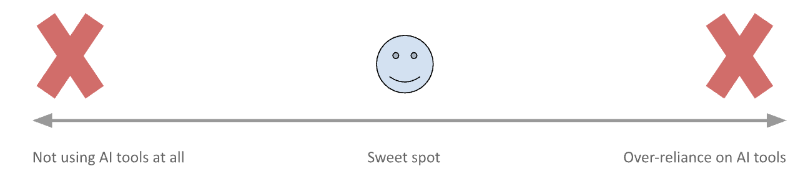

# AI Tools for ML Practitioners {#sec-ai-tools}

::: {.callout-warning}
Reading Time: 45-60 minutes
:::

At its core, an AI tool is any software, platform or service that leverages artificial intelligence and mimics human cognitive ability to perform a specific task or provide assistance to its users. The underlying technology can range from traditional machine learning algorithms to deep learning models and even rule based expert systems. We should not restrict ourselves to thinking that only the modern AI chatbots are these AI tools. An AI tool could be anything which can help us automate, optimize, learn, solve problems and make better, faster and consistent decisions. This includes:

- LLM based chatbots (ChatGPT, Gemini, Claude)
- Coding companions (GitHub Copilot, Amazon CodeWhisperer)
- AI based IDEs (Cursor)
- Cloud based AutoML platforms (Google Cloud Vertex AI, Amazon SageMaker, Microsoft Azure AutoML)
- Open sourced AutoML libraries (Auto-sklearn, AutoKeras, TPOT)
- Smart monitoring and alerting tools
- Tools which help with non-technical tasks like generating summaries, summarizing customer feedback, draft communications etc.

## Evolution and Adoptions of AI Tools

Let us look at the Gartner Hype Cycle, which maps the maturity, adoptions and widespread use of an emerging technology over time. We can see that initially an emerging technology has more media coverage and public visibility (explosion of generative AI/LLM tools in 2023-2024) even though it might not make a significant impact to its users. But over time, through iterative improvements it starts to meaningfully impact its users. In the case of AI tools, with time the tools will evolve, improve and humans will learn to use them effectively. While it is difficult to predict where we are on that curve for adoption (perhaps an interesting topic for discussion), it is clear that effective use of these AI tools will give you a competitive edge.

{#fig-gartner-hype-cycle fig-align="center" width="80%"}

An area where AI has already made a tangible impact is through AutoML based platforms and libraries. They simplify the complex process of model building by automating tasks like data preprocessing, feature engineering, model selection, and hyperparameter tuning. This allows practitioners to focus on higher-level strategic initiatives and accelerate the deployment of machine learning solutions. More recently, we've observed a surge in the adoption of tools like AI-powered coding companions and LLM based chatbots. Ultimately, the adoption of AI tools for tech practitioners is not a trend but a fundamental shift in how we approach our work. These tools offer significant potential to increase efficiency, reduce repetitive tasks, improve engineering quality, accelerate learning, and foster innovation.

## Use-Cases of AI Tools

Let’s explore how these AI tools can be leveraged as we build machine learning pipelines. Note that the below examples of using AI tools will evolve with time, and so should our behavior in consuming them appropriately.

### Learning, brainstorming and generating ideas

LLM based AI tools like ChatGPT, Gemini, Claude could be invaluable in understanding concepts, summarizing complex topics, brainstorming innovative ideas, suggesting multiple perspectives, provoking new directions, and organizing your thoughts. These LLMs are trained on an extensive corpus of texts, documents, codes, conversations, images, videos etc. We can tap into the collective wisdom embedded in their training data, enabling us to learn from other experts who tackled similar projects and encountered comparable obstacles. When used effectively, these tools can prepare us to avoid these roadblocks, preventing us from redundantly reinventing solutions.

As an example, imagine a data scientist struggling to pick a data augmentation technique for a computer vision pipeline designed to classify images of rare plant diseases. Instead of spending hours manually researching various methods and their potential impact, they could use an LLM to get started. The LLM could provide a curated list of techniques, such as specific types of image transformations (e.g., subtle rotations, color adjustments, elastic deformations), suggest relevant research papers or code examples demonstrating their application in similar scenarios, and even highlight potential pitfalls like introducing unrealistic image variations. This targeted guidance is not a replacement for a botanist with years of expertise, but can be a good starting point and can save the data scientist significant effort, allowing them to focus on other critical aspects of the ML pipeline development.

### Coding and implementation

AI tools are increasingly becoming indispensable collaborators in the coding and implementation phase of ML pipelines. They enhance efficiency, reduce errors, and accelerate the coding process. These tools offer a spectrum of capabilities, from coding companions like GitHub Copilot, Amazon CodeWhisperer, to AI-powered IDEs such as Cursor, as well as AutoML platforms. These include real-time code suggestions, intelligent debugging assistance, recommendations for optimal libraries, automated code refactoring, and the generation of comprehensive test suites. Some of the latest versions of these AI assistants are now leveraging organization’s existing code patterns to provide context-aware and tailored solutions.

As an example usage, say we have the following function which needs to be tested:
```python
def compare_versions(v1: str, v2: str) -> int:
    """
    Compare two dot‑separated version strings.
    Return 1 if v1>v2, -1 if v1<v2, 0 if equal.
    Naively splits on '.', converts each segment to int.
    """
    parts1 = [int(x) for x in v1.split('.')]
    parts2 = [int(x) for x in v2.split('.')]
    for a, b in zip(parts1, parts2):
        if a > b: 
            return 1
        if a < b:
            return -1
    # if all zipped parts equal, longer list wins
    if len(parts1) > len(parts2):
        return 1
    if len(parts1) < len(parts2):
        return -1
    return 0
```

Now as a data science professional, whose expertise lies in creating ML pipelines and working with complicated datasets, one might write the following unit tests:

```python
import pytest
from lib import compare_versions

def test_basic_equal():
    assert compare_versions("1.2.3", "1.2.3") == 0

def test_basic_greater():
    assert compare_versions("1.3.0", "1.2.9") == 1

def test_basic_less():
    assert compare_versions("2.0", "2.1") == -1
```

However, the above tests miss critical edge cases, and ones which an expert DevOps professional might easily identify:

- Trailing zeros: is "1.2" the same as "1.2.0"?
- Leading zeroes: does "01.2.3" compare differently?
- Pre‑release tags: semantic versions like "1.0.0-alpha" vs. "1.0.0"
- Mixed numeric & alphanumeric segments: "2.0.0-beta1" vs. "2.0.0-beta10"
- Empty segments or malformed: "1..2" or "1.0."

An AI driven code assistant should be able to point out such edge cases, helping make your code and the end-product more robust.

::: {.callout-important}
The important thing to note is that you do not have to be an expert in software engineering or DevOps, but you could still write high quality, well tested and robust software systems using the AI tools correctly.
:::

### Automation

Automation is crucial for building efficient and scalable ML pipelines. Complex processes can be broken down into discrete, well-defined tasks which can be executed by AI tools without continuous human oversight. This encompasses critical stages such as data labeling and preparation, feature engineering, model fine-tuning, CI/CD pipelines and ongoing monitoring. Moreover, the power of automation extends beyond the technical aspects of ML pipelines. Tools like ServiceNow and Salesforce Agentforce are baking AI capabilities into their workflows and helping with generating reports, automated customer support, drafting emails etc.

In traditional ML teams, project managers or senior data scientists spend hours each week manually reviewing and prioritizing the backlog of tasks - deciding which bug fixes are most urgent, which feature requests should be tackled first, or which experiments deserve immediate attention. This decision-making process typically involves considering multiple factors: customer impact, technical complexity, available team expertise, deadlines, and dependencies between tasks. AI task prioritization systems can now analyze 15-20 variables per task and save significant time spent organizing tasks. At companies like Atlassian, ML models have been deployed to automatically prioritize work items by analyzing historical data from previous projects, team velocity, customer feedback sentiment, and even external factors like upcoming product launches.

## Perceiving AI Tools: From Potential Threat to Powerful Accelerator

We have learnt about the capabilities of modern AI tools and how to integrate them into our workflows. But how we perceive these tools is just as crucial as how we use them. The rapid advancement of AI tools, particularly LLMs and code generation tools, naturally sparks discussion – and sometimes anxiety – about the future of roles like data scientists and engineers. Will these tools automate us out of a job? The perspective we advocate here is one of augmentation. Viewing these AI tools as collaborators rather than competitors is key to not just surviving, but thriving in the evolving fast moving field.

Think of AI tools less as autonomous replacements and more as incredibly sophisticated assistants. The fear of automation displacing jobs is not new. History provides valuable lessons. Technological shifts often transform industries, eliminating certain tasks while creating new opportunities and demanding new skills. Those who adapt thrive.

- A calculator didn't replace mathematicians but freed them from tedious arithmetic to focus on higher-level concepts.
- Tools like VisiCalc and Lotus 1-2-3 automated manual bookkeeping and calculations. However, accountants weren't eliminated, instead their roles evolved. They transitioned from manual calculation to higher-level analysis, financial modeling, and strategic advising, leveraging the new tools to provide far greater value. Those who refused to learn spreadsheets were left behind.
- In the early 1900s, photographers meticulously managed every aspect of their craft—from manually adjusting the aperture and focal point to controlling exposure settings—requiring years of specialized expertise. Modern automated cameras and smartphones didn’t replace photographers, rather abstracted away the manual operations, allowing artistic vision and ingenuity to flourish. Yet, knowing the basics of photography does elevate one’s ability to capture extraordinary images.
- Mechanized looms drastically changed textile production. While manual weavers faced disruption, individuals who learnt to operate, maintain, or design the new machines found new, often higher-value roles. The industry as a whole became vastly more productive.
- Lawyers and legal experts used to spend hours manually reading through mountains of documents to find pertinent information. Then came software with advanced NLP and ML capabilities, which could rapidly scan, index, categorize relevant documents during the “discovery” phase in a legal challenge. Legal professionals needed to adapt by learning how to effectively use these tools, frame search queries, and critically evaluate the software's output. But it did not eliminate lawyers or paralegals, instead it shifted their focus. They now spend less time on tedious reviews and more time on higher-level legal strategy, analyzing the key documents identified by the software, building arguments, and advising clients.
- The widespread adoption of ATMs starting in the 1970s. Contrary to initial fears, ATMs didn't eliminate teller jobs. Because ATMs reduced the cost of basic transactions and expanded service hours, banks often opened more branches. The role of the human teller evolved significantly – shifting away from simple cash handling towards more complex customer service, advising clients on products (loans, mortgages, investments), problem-solving, and building customer relationships. Tellers who adapted to this more “sales-and-service” oriented role became more valuable.

Similary, advanced AI tools will elevate the roles of data scientists and engineers. Embrace them as sophisticated assistants that abstract away tedious, repetitive tasks, allowing you to dedicate your invaluable expertise to higher-level problem-solving, innovative design, strategic thinking, and the nuanced interpretation of complex results. Your adaptability and willingness to integrate these tools into your workflow will not just ensure your relevance but will be the very foundation upon which you build a more impactful and fulfilling career in this rapidly evolving landscape.

## An AI tool is a Machine Learning System

While these AI tools could significantly aid us, it is crucial to recognize that they are fundamentally data-driven and/or rule-governed systems. And we will learn in later chapters that no ML system is perfect. Their efficacy is tied to the quality and representativeness of their training data, the comprehensiveness of their underlying rules and many external factors. And this makes these AI tools prone to replicating existing biases from their training data or rule sets. Moreover, recent LLM based tools are prone to generating plausible but factually incorrect information, known as hallucinations.

Additionally, these tools also lack the nuanced understanding of an organization’s specific context, project objectives and constraints. Hence practitioners should never solely rely on results from these AI tools. Rather use the AI tools as supportive aids and validate their outputs against established domain knowledge and human expertise.

Understanding the inner workings of an AI tool (machine learning system), particularly a sophisticated system like an LLM based chatbots, offers significant advantages. For instance, recognizing that a chatbot first transforms all user input: be it text, images, videos or documents into tokens provides crucial insight into its fundamental processing mechanism. Furthermore, the role of supplementary information retrieval often through Retrieval Augmented Generation (RAG), clarifies how the chatbot enriches its responses. The subsequent generation of the most probable next tokens, followed by steps like sensitive content redaction and final output refinement, constitutes a complex pipeline. Comprehending this entire process empowers a user to diagnose why a chatbot might effectively address their needs in some instances and fall short in others. Ultimately, the quality of the final output is inherently limited by the performance of its least effective component within this intricate pipeline.

## Strong fundamental knowledge is important

Let’s take an example where an ML practitioner is using an LLM based generative AI tool for help while coding. This is a prompt which they use to generate code: "Write a Python function called `calculate_average_rating` that takes a list of ratings (numbers) and returns their average". This generates the following code:

```python
def calculate_average_rating(ratings):
  if not ratings:
    return 0

  total = sum(ratings)
  count = len(ratings)
  average = total / count
  return average

# Example usage provided by LLM
sample_ratings = [4, 5, 3, 5, 4]
avg = calculate_average_rating(sample_ratings)

print(f"The average rating is: {avg}")
# Output: The average rating is: 4.2
```

In the first pass, the response looks very impressive. The tool even adds a check to make sure division by 0 never occurs in the code. We might not think much about this trivial logic, integrate this in our production pipeline and move ahead. However, the real world is messy. There could be cases where one of the ratings got corrupted and we run an input like below through our function: `[4, 5, n/a, 3]`. When called with the above input, our “calculate_average_rating” function would likely raise a TypeError, and could cause the production pipeline to error out, causing expensive implications for a system. In contrast to the straightforward error demonstrated above, a production ML pipeline is an intricate and interconnected network of multiple subsystems. As a result, some errors can be far more difficult to diagnose, isolate, and rectify, leading to significant downtime.

Consider the seemingly straightforward prompt: “Implement a Transformer network for text summarization in Python using the PyTorch library.” While a generative AI tool will produce code that fulfills this request, it would inherently involve numerous implicit choices. The user might remain unaware of the specific architectural decisions made by the AI – such as the number of encoder and decoder layers, the dimensionality of the hidden states, the choice of attention mechanisms, or the data preprocessing pipeline employed. These assumptions can significantly impact the resulting model's performance, efficiency, and even its suitability for the intended application, often with unseen advantages, disadvantages, and limitations.

The above examples emphasize a crucial learning: it is very important to develop strong foundational knowledge when using LLM/generative AI tools effectively and responsibly. These tools enable us to implement solutions without having a deep understanding of the underlying concepts. This sounds very exciting in the short term but could be dangerous in the long term. It works when building a quick prototype to experiment an idea or during initial iterations. However, when the objective is to build robust, scalable machine learning systems for production environments, a lack of deep understanding can lead to significant vulnerabilities and limitations. This lesson becomes increasingly vital as AI tools advance, their adoption broadens, and our reliance on them deepens. Proactively acknowledging the limitations of these tools and adopting necessary fail-safe mechanisms is far more prudent than learning them through hard-won experiences.

## Data Privacy

While the integration of AI tools is encouraged, a comprehensive understanding of their data handling practices, particularly user data and feedback, is paramount. It is crucial to acknowledge that project details, technical specifications, innovative concepts, discussion notes, source code constitute the intellectual property of your organization.

This consideration is especially critical in the context of free-to-use cloud-based AI tools, which frequently leverage user data as a mechanism for continuous model refinement and service enhancement. Importantly, the user data is not just exposed to the AI tool itself, but also across the entire infrastructure stack. This includes your web browser, any browser extensions, network devices (router/modem/switches), Virtual Private Network (VPN), the Internet Service Provider (ISP), the Domain Name System (DNS) provider, the AI tool provider etc. Although most modern services implement end-to-end encryption protocols, the risk of data leakage is always non-zero.

### Local LLMs

These data privacy concerns, particularly the exposure of sensitive intellectual property, can be significantly mitigated by running LLMs locally. When using LLM models or AI tools via these frameworks, data never leaves your system as the LLM model runs on your computer, locally. Tools like Ollama and LM Studio exemplify this approach by simplifying the process of downloading, configuring, and running various open-source LLMs directly on local machines (desktops, servers). They abstract away much of the complexity involved in setting up these models, making local deployment accessible even without deep AI engineering expertise.

## Key Takeaway

If there is one message which you could take away from this chapter then it is: Don't be afraid of AI tools, be afraid of becoming irrelevant by not using them. The practitioners most likely to be "replaced" are not those competing against AI, but those who fail to adapt and leverage AI's potential.

{#fig-balance-ml-tools fig-align="center" width="80%"}

Strive to maintain the right balance with AI tools. On the left side is a practitioner who does not use these tools, and does not adapt. On the right side is a practitioner who is over reliant on these tools, and develops a habit of blindly trusting these AI tools. Being on either of the extremes is a bad idea. Somewhere in the middle like the sweet spot.
