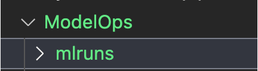
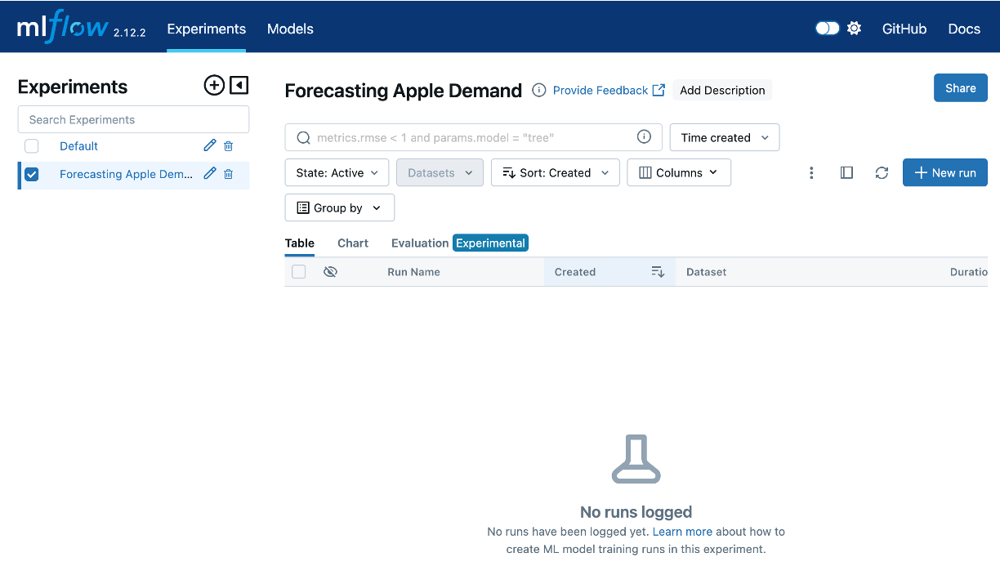
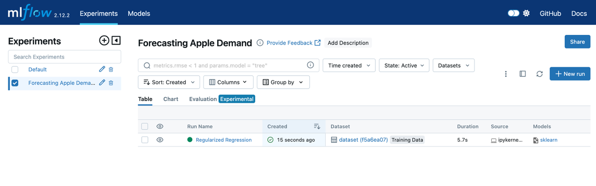
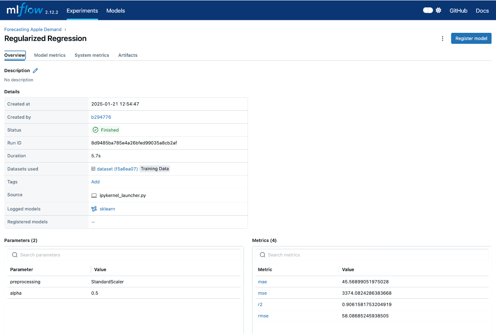
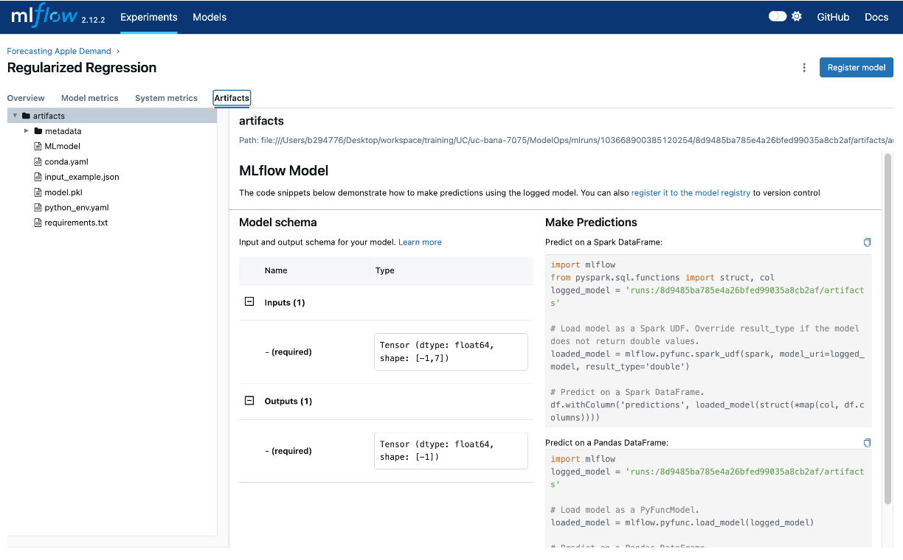
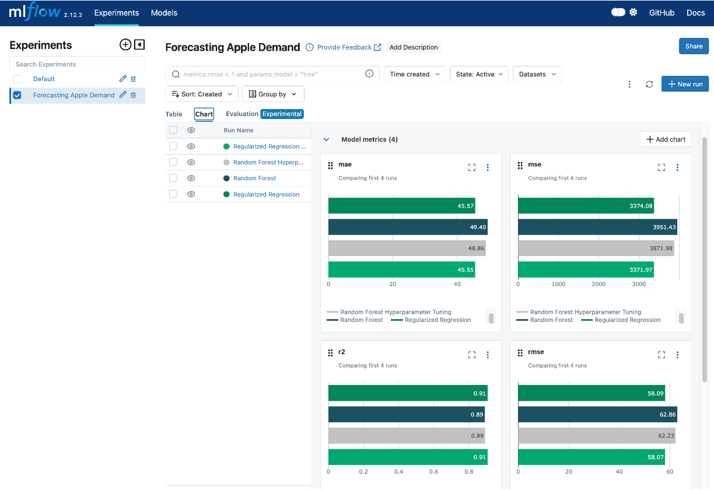

# Model Training and Experiment Tracking {#sec-model-experimentation}

::: {.callout-warning}
Reading Time: 40-55 minutes
:::

Model training is the cornerstone of machine learning, where algorithms learn patterns from data to make predictions or decisions. The process involves feeding a machine learning model with labeled data, enabling it to map inputs to desired outputs. This stage is critical because the effectiveness of the entire ML system hinges on the model’s ability to generalize from training data to unseen scenarios. However, achieving high performance is rarely straightforward and often requires iterative experimentation.

Training a model is not a one-and-done process. It involves an iterative cycle of hypothesis testing, parameter tuning, and evaluation to optimize performance. Data scientists experiment with hyperparameters, datasets, preprocessing techniques, and algorithms to achieve the best outcomes. Each experiment builds on the previous, gradually refining the model’s capabilities. This trial-and-error approach, while powerful, introduces complexities, especially when dealing with multiple experiments, diverse datasets, and varying metrics.

::: {#fig-ml-experimentation}


Modeling Experimentation. Machine learning inherently involves iterative experimentation, where data scientists test various combinations of features, algorithms, hyperparameters, datasets, and preprocessing techniques.
:::

This is where **experiment tracking** becomes indispensable. Experiment tracking provides a structured approach to documenting every aspect of the training process, including hyperparameters, datasets, metrics, and results. By systematically recording these details, experiment tracking enables reproducibility, facilitates performance comparisons, and enhances collaboration among team members. Without it, teams risk losing valuable insights, duplicating efforts, or struggling to identify why a particular experiment succeeded or failed.

In this chapter, we will explore the concepts, tools, and best practices for model training and experiment tracking. By the end, you will understand how to set up workflows that not only optimize model performance but also ensure transparency, reproducibility, and efficiency in machine learning projects.

## The Role of Experiment Tracking

Experiment tracking is a cornerstone of effective model training and machine learning workflows. It ensures that the process of developing and refining machine learning models is both systematic and reproducible. Without robust experiment tracking, teams can quickly lose visibility into the details of their experiments, leading to inefficiencies, redundancies, and missed opportunities for optimization.

### Why Experiment Tracking is Crucial

Machine learning inherently involves iterative experimentation, where data scientists test various combinations of features, algorithms, hyperparameters, datasets, and preprocessing techniques.

::: {.callout-note}
For example, consider building a model to predict customer churn. A data scientist might experiment with different features, such as customer demographics, purchase history, and customer support interactions, to determine which combinations provide the most predictive power. They may even experiment with different feature engineering approaches such as one-hot encoding versus label encoding versus embeddings.

Simultaneously, they might test various algorithms, such as logistic regression, random forests, or gradient boosting, each with its unique strengths. Within each algorithm, the data scientist adjusts hyperparameters like learning rates, tree depths, or regularization terms to optimize performance.
:::

Tracking these experiments is vital for:

- **Reproducibility**: In machine learning, reproducibility is paramount. Experiment tracking allows practitioners to retrace their steps and recreate previous results by logging hyperparameters, datasets, metrics, and configurations. This ensures that successful experiments can be reliably reproduced and built upon.
- **Performance Comparison**: With multiple experiments generating diverse results, experiment tracking provides a systematic way to compare performance across iterations. By maintaining a history of experiments and their outcomes, data scientists can identify which configurations yield the best results and uncover patterns for improvement.

### Facilitating Collaboration

Experiment tracking fosters collaboration by creating a shared repository of insights and progress across team members. When data scientists and engineers work together on complex projects, a robust tracking system offers:

- **Transparency**: Everyone on the team can view the history of experiments, including the rationale behind each decision and the results achieved. This shared knowledge base reduces silos and ensures alignment.
- **Knowledge Sharing**: Experiment tracking serves as a centralized resource for storing valuable learnings, enabling new team members to onboard quickly and contribute effectively.
- **Accountability**: By maintaining a detailed log of decisions and results, experiment tracking helps teams remain accountable for their work, supporting better communication and project management.

### Challenges Without a Tracking System

Without a dedicated experiment tracking system, managing experiments can quickly become chaotic, especially as the scale and complexity of machine learning projects grow. Common challenges include:

- **Loss of Information**: In the absence of structured tracking, valuable details like hyperparameter settings, dataset versions, or preprocessing techniques may be lost or poorly documented, making it difficult to recreate successful experiments.
- **Duplication of Effort**: Team members may unknowingly repeat similar experiments, wasting time and resources that could be better spent exploring new avenues.
- **Inefficient Debugging**: When issues arise, the lack of a tracking system complicates the process of identifying which experiment or configuration caused the problem.
- **Hindered Scaling**: As the number of experiments grows, managing them without a system becomes unmanageable, leading to a lack of focus and slower progress.

By addressing these challenges, experiment tracking systems provide a structured approach to managing the complexities of model training, ultimately enhancing efficiency, collaboration, and the quality of machine learning workflows. In the next section, we will explore tools and techniques for implementing effective experiment tracking systems.

## Tools for Experiment Tracking

Experiment tracking tools streamline the process of managing and documenting machine learning experiments, making it easier to record hyperparameters, metrics, datasets, and results. By providing structured repositories for experiment metadata, these tools enhance reproducibility, foster collaboration, and support performance comparisons. Below, we explore three popular experiment tracking tools — **MLflow**, **Weights & Biases**, and **Comet.ml** — and discuss their unique features and strengths.

::: {.callout-note collapse="true"}
## MLflow

[MLflow](https://mlflow.org/) is an open-source platform designed to manage the end-to-end machine learning lifecycle. Its experiment tracking module allows users to log parameters, metrics, and artifacts for each run.

- **Features**:
  - Logs hyperparameters, metrics, and output files.
  - Integrates with popular libraries like TensorFlow, PyTorch, and Scikit-learn.
  - Offers a user-friendly interface to compare experiments.
  - Includes a model registry for tracking model versions and deployment status.

- **Strengths**:
  - Easy to set up and use with Python scripts or Jupyter notebooks.
  - Strong focus on model versioning and lifecycle management.
  - Open-source, making it cost-effective and extensible.

- **When to Use**:
  - Ideal for teams that prefer open-source solutions.
  - Works well for workflows with minimal external tool dependencies.
  - Suitable for projects where model versioning is a priority.
:::

::: {.callout-note collapse="true"}
## Weights & Biases

[Weights & Biases](https://wandb.ai/site/) is a robust platform built for tracking experiments, collaborating on results, and visualizing model performance in real time.

- **Features**:
  - Tracks hyperparameters, metrics, datasets, and visualizations for experiments.
  - Provides live dashboards to monitor experiment progress.
  - Enables team collaboration with project workspaces and shared reports.
  - Integrates seamlessly with frameworks like Keras, PyTorch, and TensorFlow.

- **Strengths**:
  - Excellent for teams with collaborative workflows.
  - Offers detailed visualizations for experiment analysis.
  - Supports large-scale projects with multiple contributors and pipelines.

- **When to Use**:
  - Perfect for teams working on collaborative machine learning projects.
  - Best for scenarios where real-time insights and advanced visualizations are critical.
  - Particularly useful for distributed teams needing shared dashboards.
:::

::: {.callout-note collapse="true"}
## Comet.ml

[Comet.ml](https://www.comet.com/site/) is a powerful platform for managing, visualizing, and sharing experiments. It focuses on providing actionable insights and integrating with existing workflows.

- **Features**:
  - Logs experiment parameters, metrics, assets, and source code.
  - Provides real-time dashboards for tracking performance.
  - Offers integrations with popular frameworks and cloud services.
  - Includes team collaboration features like shared experiment spaces.

- **Strengths**:
  - Comprehensive real-time insights and monitoring.
  - Extensive integrations with cloud-based workflows.
  - Allows easy sharing and exporting of experiment results.

- **When to Use**:
  - Ideal for teams requiring real-time experiment tracking and reporting.
  - Suitable for workflows heavily reliant on cloud environments.
  - Works well for organizations needing robust integration capabilities.
:::

Each tool offers unique strengths, and the choice depends on the team’s workflow, priorities, and resources. Below is a comparison to help select the right tool:

| Feature/Tool        | **MLflow**                         | **Weights & Biases**               | **Comet.ml**                    |
|---------------------|------------------------------------|------------------------------------|----------------------------------|
| **Ease of Use**      | Simple and intuitive              | User-friendly with rich features   | Easy setup with intuitive UI    |
| **Collaboration**    | Basic                            | Advanced collaborative workspaces  | Shared experiment spaces        |
| **Visualization**    | Moderate                         | Advanced real-time dashboards      | Real-time insights              |
| **Integrations**     | Strong support for ML libraries   | Broad support for frameworks       | Extensive cloud integrations    |
| **Best For**         | Model versioning and lifecycle    | Team collaboration and visualization | Real-time monitoring and insights |

Experiment tracking is critical for modern machine learning workflows, and the choice of tool depends on the specific needs of the project. Whether prioritizing collaboration, scalability, or integration, these tools provide robust capabilities to manage and optimize experiments effectively. In the upcoming sections, we will explore practical examples to demonstrate how these tools fit into end-to-end workflows.

::: {.callout-note}
While this section focuses on **MLflow**, **Weights & Biases**, and **Comet.ml**, it's important to note that other experimentation tracking tools are also available. For example, **DVC (Data Version Control)**, while primarily known for data versioning, also supports experiment tracking by managing metadata and creating reproducible pipelines. Tools like DVC are particularly useful when experiment tracking is closely tied to versioning datasets and model artifacts. Exploring these alternatives can provide additional flexibility based on your specific project requirements and team preferences.
:::

## Key Components to Track

Effective experiment tracking in machine learning involves systematically logging key components of your experiments. This not only ensures reproducibility but also allows for meaningful comparisons, collaboration, and continuous improvement. Below, we discuss the main components to track and why each is critical for successful machine learning workflows.

::: {.callout-note collapse="true"}
## Experiment Details

- **What to Track**: Experiment names, descriptions, and objectives.
- **Why It Matters**: Clear documentation about the purpose and context of each experiment is essential for managing complex workflows. Without proper naming and descriptions, experiments can become difficult to distinguish, especially when managing numerous iterations. This clarity allows data scientists and engineers to:
   - **Quickly Identify Relevant Experiments**: Teams can easily locate specific experiments to analyze results or refine models without sifting through unrelated runs.
   - **Provide Context for Results**: Detailed descriptions capture the “why” behind an experiment, such as testing a hypothesis or exploring a new feature, which is invaluable for understanding outcomes.
   - **Facilitate Collaboration**: With well-documented experiments, team members can seamlessly pick up where others left off, reducing duplication of effort and enhancing collective productivity.
   - **Ensure Long-Term Usability**: Months after running experiments, clear documentation helps recall why certain configurations were tested, aiding in retrospective analysis or compliance audits.
:::

::: {.callout-note collapse="true"}
## Dataset and Preprocessing

- **What to Track**: Details about the dataset (e.g., source, version, size) and preprocessing steps (e.g., scaling, feature selection, encoding).
- **Why It Matters**: Documenting the dataset and its transformations ensures reproducibility and accountability. It also helps in understanding how changes in data preprocessing affect model outcomes.
:::

::: {.callout-note collapse="true"}
## Hyperparameters and Model Configurations

- **What to Track**: Hyperparameters (e.g., learning rate, batch size) and model configurations (e.g., max depth for trees, kernel type for SVMs).
- **Why It Matters**: Logging hyperparameters enables teams to understand how specific configurations impact model performance. Without this, reproducing successful experiments or diagnosing underperformance becomes nearly impossible.
:::

::: {.callout-note collapse="true"}
## Performance Metrics

- **What to Track**: Evaluation metrics such as RMSE, MAE, accuracy, or F1-score.
- **Why It Matters**: Metrics provide a quantitative basis for comparing experiments and determining the best-performing model. Tracking these consistently over time helps identify performance trends.
:::

::: {.callout-note collapse="true"}
## Model Artifacts

- **What to Track**: Trained models, including their weights and configurations, and any associated metadata such as example input and model architecture.
- **Why It Matters**: Storing model artifacts ensures that the exact model version can be retrieved for inference, further training, or deployment.
:::


::: {.callout-note collapse="true"}
## Environment and Dependencies

- **What to Track**: Information about the software environment, including library versions, frameworks, and system dependencies.
- **Why It Matters**: Capturing environmental details ensures consistency across experiments, making it possible to reproduce results in the same setup.
:::

These components form the backbone of a well-structured experiment tracking workflow, ensuring that every step of the machine learning lifecycle is documented, reproducible, and actionable. In the next section, we’ll bring these components to life with a hands-on example using MLflow. This will demonstrate how to implement an experiment tracking system in practice.

## Hands-On Example: Implementing Experiment Tracking {#sec-experiment-tracking}

In this section, we’ll demonstrate an experiment tracking workflow using MLflow. We'll highlight the key components of experiment tracking as we log a few model experiments, showcasing how MLflow helps to track, compare, and analyze their results systematically.

::: {.callout-note}
For this example, we're going to pretent that we are data scientists for a national grocery retailer and we work on a team who's responsibility is to forecast demand for produce.  For this project, we are going to forecast demand specifically for apples.
:::

### Basic Requirements

If you'd like to follow along and execute this code then there are a few requirements you'll need on your end.

::: {.callout-tip}
You can find the requirements, source code for the model experimentation tracking, and helper functions [here](https://github.com/bradleyboehmke/uc-bana-7075/tree/main/ModelOps).
:::

First, you'll need to make sure you have the following Python libraries installed:



Next, let's load our required libraries. You'll notice that we load a function from an [`apple_data` module](https://github.com/bradleyboehmke/uc-bana-7075/blob/main/ModelOps/apple_data.py); this is a local module I created to help create data for this example.



### Create Experimentation Project

The first step is to create a new experiment. Since we are forecasting the demand of apples we'll make it obvious in our project name.



Once you've run this code, you will notice an `mlruns` directory created in your current working directory. This is where all the parameters, metrics, and artifacts that we log for each experiment will be stored.

::: {#fig-directory-layout}
{width=50%}

Directory layout after creating a new MLflow experiment. The `mlruns` directory will contain all the logs, parameters, metrics, and artifacts that we log for each experiment.
:::

MLflow comes with a user-friendly interface that allows you to visualize and manage your experiments. By running the command `mlflow ui` in your terminal, MLflow will start a local server and provide a URL (typically `http://localhost:5000` or something similiar). The following is the output I get when I run `mlflow ui`:

```bash
mlflow ui
[2025-01-21 11:44:21 -0500] [62996] [INFO] Starting gunicorn 22.0.0
[2025-01-21 11:44:21 -0500] [62996] [INFO] Listening at: http://127.0.0.1:5000 (62996)
[2025-01-21 11:44:21 -0500] [62996] [INFO] Using worker: sync
[2025-01-21 11:44:21 -0500] [62997] [INFO] Booting worker with pid: 62997
[2025-01-21 11:44:21 -0500] [62998] [INFO] Booting worker with pid: 62998
[2025-01-21 11:44:21 -0500] [62999] [INFO] Booting worker with pid: 62999
[2025-01-21 11:44:21 -0500] [63001] [INFO] Booting worker with pid: 63001
```

I can then click on the http://127.0.0.1:5000 URL listed in the output and this will open the MLflow UI in your web browser, where you can view detailed information about your experiments, including parameters, metrics, and artifacts. This interface makes it easy to compare different runs and track the progress of your machine learning projects.

::: {.callout-tip}
Initially, this UI will be empty because we haven't ran any experiments yet but you can keep it open as we run the experiments that follow and see the dashboard update.
:::

::: {#fig-mlflow-empty}


MLflow UI when no experiments have been run yet. This interface will populate with experiment details as we log our runs.  Also, note the "Add Description" next to the experiment name; this is a great place to add clear documentation about the purpose and context of your experiment.
:::

### Synthetic Training Data

The data that we will use for our ML modeling will be synthetic apple data created by the code in the [`apple_data.py` module](https://github.com/bradleyboehmke/uc-bana-7075/blob/main/ModelOps/apple_data.py). This module generates a dataset that simulates apple demand, including features such as date, weather conditions, and promotional activities. By using synthetic data, we can control the complexity and characteristics of the dataset, ensuring it is suitable for demonstrating the experiment tracking workflow without relying on proprietary or sensitive real-world data.



Next, we will create out training and validation data splits:



### Experiment 1: Regularized Regression

For the first experiment we'll train a regularized regression model. To do so we:

1. Scale our training data (distributional requirement of regularized regression)
2. Train our model
3. Evaluate the results
4. Log our experiment run with MLFlow





This next code chunk will log all the items we want to track into an experiment run titled "Regularized Regression".  In this example we are logging the training data, feature engineering steps applied, the hyperparameters applied to this model (i.e. `alpha`), the model results, and the actual model itself.  Also, MLflow automatically tracks aspects of the environment, such as library versions and Python dependencies, and will log this information as well.



Now, if we look at the MLFlow UI, we'll see our experiment run:

::: {#fig-mlflow-experiment1}


MLflow UI after we ran our initial regularized regression experiment.
:::

And if we click on the experiment run we can see the information logged with that experiment:

::: {#fig-mlflow-experiment1-details layout-ncol=2}
{#fig-params}

{#fig-artifacts}

We can see various details of the regularized regression experiment run in the MLflow UI such as the logged hyperparameter values, the model evaluation metrics, and even the artifacts logged such as the model and environment requirements to recreate the model.
:::

### Additional Experiments

If you take a look at the [model experimentation notebook](https://github.com/bradleyboehmke/uc-bana-7075/blob/main/ModelOps/model-experimentation.ipynb) you will see that we followed this up with 3 additional experiment runs:

1. A random forest model with set hyperparameter values
2. A random forest hyperparameter grid search
3. A regularized regression hyperparameter grid search

Each experiment run followed a similar process to log the experiment run details in MLFlow. Consequently, our MLFlow UI now shows 4 different experiments runs.  The UI also allows us to compare the different experiment runs across our evaluation metrics.

::: {#fig-mlflow-experiment-comparison}


Comparing the model evaluation metrics for the various experiments.
:::

::: {.callout-note}
This hands-on example demonstrates just some of the basic functionalities of MLflow's experiment tracking capabilities. MLflow offers a wide range of features for more advanced experiment tracking and comparison capabilities. To explore these capabilities further, check out the [MLflow documentation](https://mlflow.org/docs/latest/index.html).
:::

## Common Challenges

Model training and experimentation tracking are essential for building effective machine learning systems, but they come with notable challenges:

::: {.callout-note collapse="true"}
## Managing a High Volume of Experiments

As projects grow, teams often run dozens—or even hundreds—of experiments to optimize models. Without a structured tracking system, it becomes difficult to organize, retrieve, and compare results.

**Solution**: Use centralized tools like [MLflow](https://mlflow.org/) or [Weights & Biases](https://wandb.ai/) to log experiments automatically and enable searchability across iterations.Moreover, its important to establish how to organize experiment runs so as the volume of runs increase, organization and searchability remain intact.
:::

::: {.callout-note collapse="true"}
## Maintaining Consistency in Logging Practices

Inconsistent logging of hyperparameters, metrics, or datasets can lead to confusion and reproducibility issues.

**Solution**: Establish clear team-wide guidelines for experiment tracking, specifying what should be logged (e.g., hyperparameters, datasets, metrics) and how to format entries.
:::

::: {.callout-note collapse="true"}
## Collaborating Across Teams

Collaboration between data scientists, engineers, and stakeholders can become fragmented when different teams use varying tools or workflows.

**Solution**: Adopt platforms that support shared access, real-time updates, and version control. Tools like [DVC](https://dvc.org/), [MLflow](https://mlflow.org/), and [Comet.ml](https://www.comet.com/) facilitate collaborative experimentation and model management that can make enterprise-wide collaboration easier.
:::

By addressing these challenges through robust tools and consistent practices, teams can streamline workflows, enhance collaboration, and improve the overall quality of their machine learning systems.

::: {.callout-tip}
To explore more strategies for overcoming these challenges:

- [Experiment Tracking Best Practices (Weights & Biases)](https://wandb.ai/site/articles/experiment-tracking)
- [Effective Experimentation with MLflow](https://mlflow.org/docs/latest/index.html)
:::


## Summary

In this chapter, we explored the critical aspects of model training and experiment tracking, emphasizing the importance of structured workflows for managing machine learning experiments. We covered key components to track—datasets, hyperparameters, metrics, and model artifacts—and demonstrated how tools like MLflow can streamline this process. Additionally, we addressed common challenges such as managing high experiment volumes, maintaining consistency, and fostering collaboration across teams.

Experiment tracking is a cornerstone of ModelOps, ensuring reproducibility, performance comparison, and effective collaboration. By establishing robust tracking workflows, teams can optimize their machine learning models while maintaining clarity and organization.

In the next chapter, we will build on this foundation by delving into model versioning and registration, showcasing how to manage and deploy trained models systematically. This step will further integrate and solidify the principles of scalable and reliable ModelOps practices.

## Exercise {#sec-model-experimentation-exercise}

This exercise has three parts: **conceptual design**, **hands-on experimentation**, and **reflection on design principles**. The goal is to gain practical experience in experiment tracking with MLflow while considering how key principles of good ML system design apply to model experimentation.

::: {.callout-note collapse="true"}
## Context for the Exercise

Imagine you are working as a data scientist for [**Zillow**](https://www.zillow.com/), a company known for its real estate insights and services. Your task is to develop a machine learning model that predicts home prices in California. This model will help Zillow provide more accurate price estimates for listings, improving user experience and market insights.

You’ll use the [California Housing dataset](https://inria.github.io/scikit-learn-mooc/python_scripts/datasets_california_housing.html) to simulate this analysis, focusing on building and tracking experiments to evaluate different models and techniques. By leveraging experiment tracking with MLflow, you’ll ensure that your workflow is structured, reproducible, and aligned with industry standards for machine learning system design.
:::

::: {.callout-note collapse="true"}
## Part 1: Conceptual Design

Before diving into implementation, think through the design of an experiment tracking workflow for the California Housing dataset. Consider the following:

1. **Experiment Objectives**:
   - Define the purpose of the experiments. For example:
     - Compare the performance of different regression models on the California Housing dataset.
     - Evaluate the impact of feature engineering or hyperparameter tuning.

2. **Key Components to Track**:
   - Identify what you need to log during the experiments:
     - Experiment run metadata - what name and description would you include as metadata?
     - Model training data - are there any preprocessing/feature engineering steps you'll need to perform and log?
     - What models do you want to experiment with?
     - What hyperparameters need to be tracked for each model?
     - Which evaluation metrics do you want to assess (e.g., RMSE, MAE, R²)?
     - Anything else you should track?

3. **Outcome Goals**:
   - Define success criteria for the experiments:
     - Which metrics will determine the best model?
     - How will you compare results across experiments?

Document your conceptual plan in a short paragraph or diagram.
:::

::: {.callout-note collapse="true"}
## Part 2: Hands-On Experimentation

Now implement your design using the California Housing dataset and MLflow. Follow these steps:

1. **Set Up Your Environment**:
   - Install necessary libraries:
     ```bash
     pip install mlflow scikit-learn pandas matplotlib
     ```
   - Import required modules:
     ```python
     import mlflow
     import mlflow.sklearn
     from sklearn.datasets import fetch_california_housing
     from sklearn.model_selection import train_test_split
     from sklearn.ensemble import RandomForestRegressor
     from sklearn.linear_model import LinearRegression
     from sklearn.tree import DecisionTreeRegressor
     from sklearn.metrics import mean_squared_error, mean_absolute_error, r2_score
     ```

2. **Create an MLflow Experiment**:
   - Initialize and name your MLflow experiment:
     ```python
     mlflow.set_experiment("<Experiment name>")
     ```

3. **Prepare the Dataset**:
   - Load and split the data:
     ```python
     data = fetch_california_housing(as_frame=True)
     X = data.data
     y = data.target
     X_train, X_test, y_train, y_test = train_test_split(X, y, test_size=0.2, random_state=42)
     ```

4. **Train and Log Models**:
   - Train at least three models (e.g., Random Forest, Linear Regression, Decision Tree).
   - For each model, log the key components identified in Part 1:
     - Training data details.
     - Hyperparameters.
     - Metrics.
     - Model artifacts.

5. **Compare Results in MLflow**:
   - Launch the MLflow UI to compare experiment results.
   - Identify the best-performing model based on metrics like RMSE or R².
   - Examine the logged parameters and artifacts of the best model.
:::

::: {.callout-note collapse="true"}
## Part 3: Reflection on Design Principles

Go back to [Chapter @sec-design-principles] and reflect on how the experiment tracking workflow aligns with at least 4 of the principles discussed. For example:

1. **Modularity**:
   - How did separating the data preparation, model training, and logging components make the workflow more organized and reusable? Could this be improved?

2. **Reproducibility**:
   - How did MLflow’s logging features ensure reproducibility of experiments, enabling you to retrace steps for the best-performing model?

3. **Scalability**:
   - Consider how this workflow might scale to larger datasets, more complex model comparisons, or a higher volume of experiment runs.

4. **Abstraction**:
   - Reflect on how MLflow abstracted away many tracking complexities, allowing you to focus on experimentation.
:::


## LLM Exercise

::: {.callout-note}
This example was run on a MacOS computer with an M3 Pro chipset and MPS (Metal Performance Shaders) support. If you are using a different operating system or hardware, you may need to adjust some settings or dependencies to ensure compatibility.
:::

In this exercise, we will apply the prinxiples of model training and experiment tracking to our ongoing project: the AI-powered customer support assistant. In the previous chapters, we prepared and versioned a dataset suitable for fine-tuning, and discussed ModelOps strategies. Now, we will take the next step: fine-tuning a base language model on this data and, most importantly, tracking our experiments to ensure our process is reproducible and our results are comparable.

We will use the Hugging Face transformers library to finetune a gpt2 LLM model. Our primary goal is to integrate MLflow into the training process to log hyperparameters, metrics, and the resulting model artifact. This exercise will give you handson experience with the core components of experiment tracking in an LLM context.

### LLM Specific Considerations

Before we dive into the code, it's important to highlight a few aspects unique to training Large Language Models that differ significantly from traditional machine learning models

- Model Choice (gpt2): We are using gpt2 for this exercise because it is a foundational and well understood. At 124 million parameters, it is small enough to be fine-tuned on consumer hardware. The principles learnt while fine-tuning gpt2 are directly applicable to much larger models.

- Hardware Acceleration (GPU/MPS): Training LLMs is incredibly computationally expensive due to the billions of calculations required for each training step. While traditional models like linear regression or random forests can often be trained on a CPU, LLMs require specialized hardware for practical training times.
  - NVIDIA's CUDA platform are the industry standard for this, as they are designed for the massive parallel matrix operations at the core of transformer models.
  - Apple Silicon (MPS) provides similar acceleration on modern Macs.
  - Without hardware acceleration, fine-tuning even a small model like gpt2 could take days instead of minutes. The transformers and PyTorch libraries automatically detect and use available hardware, abstracting away much of the complexity.
- Memory Management: LLMs, their gradients, and optimizer states consume a large amount of memory. This is why techniques like gradient accumulation, mixed-precision training, and quantization are common in LLM workflows but less so in traditional ML. For our exercise, the default settings will suffice, but for larger models, managing memory becomes a primary challenge.

::: {.callout-warning}
Note: Ensure your system has sufficient memory to run the training scripts below. The MacOS machine used for these examples had 18 GB of memory, which was nearly fully utilized during training. Depending on your hardware, training may take several minutes and could require significant system resources.
:::

### Setup and Preparation

The code for this exercise is inspired by this [LLM fine-tuning repository](https://github.com/yash91sharma/llm_finetuning). Refer to this repository for more variations.

First, ensure you have the necessary libraries installed. We'll need `transformers`, `datasets` for data handling, `torch` as the backend, and `mlflow` for tracking.

```bash
pip install transformers datasets torch mlflow accelerate
```

Next, we'll create a Python script to handle the fine-tuning process. This script will:
1.  Load the processed customer support dataset (`llm_training_data.jsonl`).
2.  Set up a gpt2 model and tokenizer.
3.  Configure an MLflow experiment.
4.  Use the Trainer API from transformers to fine-tune the model.
5.  Log hyperparameters, metrics, and the final model to MLflow.

### Hands-On Fine-Tuning and Tracking

Create a Python script named `track_finetuning.py`. This script will encapsulate our training logic.

```python
import mlflow
import torch
from datasets import load_dataset
from transformers import (
    AutoModelForCausalLM,
    AutoTokenizer,
    TrainingArguments,
    Trainer,
    DataCollatorForLanguageModeling,
)

# --- Set up MLflow Experiment ---
mlflow.set_experiment("Customer Support LLM Fine-Tuning")

def main():
    # --- Define Hyperparameters and Configuration ---
    model_name = "gpt2"
    dataset_path = "path/to/llm_training_data.jsonl"
    output_dir = "./results"
    
    training_args = TrainingArguments(
        output_dir=output_dir,
        num_train_epochs=1,
        per_device_train_batch_size=4,
        learning_rate=5e-5,
        logging_dir='./logs',
        logging_steps=10,
        report_to="mlflow",  # Integrate with MLflow
    )

    # --- Load and Prepare the Dataset ---
    tokenizer = AutoTokenizer.from_pretrained(model_name)
    # Set the pad token
    if tokenizer.pad_token is None:
        tokenizer.pad_token = tokenizer.eos_token

    raw_datasets = load_dataset('json', data_files=dataset_path)

    def tokenize_function(examples):
        # Simple concatenation of instruction, input, and output for language modeling
        text = [
            f"Instruction: {inst}\nInput: {inp}\nOutput: {out}"
            for inst, inp, out in zip(examples['instruction'], examples['input'], examples['output'])
        ]
        return tokenizer(text, truncation=True, padding="max_length", max_length=512)

    tokenized_datasets = raw_datasets.map(tokenize_function, batched=True, remove_columns=raw_datasets["train"].column_names)
    
    # --- Load Model and Data Collator ---
    model = AutoModelForCausalLM.from_pretrained(model_name)
    data_collator = DataCollatorForLanguageModeling(tokenizer=tokenizer, mlm=False)

    # --- Start MLflow Run and Train ---
    with mlflow.start_run(run_name=f"finetune-{model_name}-lr-{training_args.learning_rate}") as run:
        # Log hyperparameters
        mlflow.log_params({
            "model_name": model_name,
            "learning_rate": training_args.learning_rate,
            "num_epochs": training_args.num_train_epochs,
            "batch_size": training_args.per_device_train_batch_size,
            "dataset": dataset_path
        })

        trainer = Trainer(
            model=model,
            args=training_args,
            train_dataset=tokenized_datasets["train"],
            tokenizer=tokenizer,
            data_collator=data_collator,
        )

        # Train the model
        trainer.train()

        # --- Log Model and Final Metrics ---
        # The Trainer automatically logs metrics like loss to MLflow
        # We can log the final model artifact
        trainer.save_model(output_dir)
        mlflow.log_artifacts(output_dir, artifact_path="model")
        
        print("Training complete and artifacts logged to MLflow.")

if __name__ == "__main__":
    main()
```


::: {.callout-note collapse="true"}
Create dummy data.

Generate a sample dataset containing between 50 and 100 examples, and save it in the llm_training_data.jsonl file, which will be used for model fine-tuning. Ensure the dataset includes a wide range of languages, vocabulary, topics, and perspectives to maximize diversity and representativeness.

AI tools can be highly effective for generating dummy data. Large language models can quickly produce diverse and realistic examples across multiple languages and topics. By carefully crafting prompts and reviewing outputs, you can ensure both quality and variety in your dataset.
:::


To run the experiment, execute the script from your terminal:

```bash
python path/to/track_finetuning.py
```

### Compare Experiments in MLflow

Once the script finishes, launch the MLflow UI to inspect the run:

```bash
mlflow ui
```

Navigate to `http://127.0.0.1:5000` in your browser. You will see the "Customer Support LLM Fine-Tuning" experiment with one run. Click on it to see the logged parameters (learning rate, epochs) and metrics (training loss).

Now, run a second experiment to see the power of comparison. **Edit `track_finetuning.py`** and change a hyperparameter, for example, the learning rate:

```python
// ...existing code...
    training_args = TrainingArguments(
        output_dir=output_dir,
        num_train_epochs=1,
        per_device_train_batch_size=4,
        learning_rate=2e-5,  # Changed learning rate
// ...existing code...
```

Run the script again. Refresh the MLflow UI, and you will see a second run. You can now select both runs and click "Compare" to see a side-by-side view of their parameters and performance, making it easy to determine which configuration performed better.

::: {.callout-note collapse="true"}
Try to refine the model further

With your initial fine-tuning run, the model’s performance may be suboptimal. Its responses might be incomplete, ill-formed, repetitive, or contain grammatical and typographical errors. Experiment with different hyperparameters and iterate to enhance the model. Develop an intuition for what works best with your model and dataset.
:::

### Reflection on Design Principles

Reflect on how this exercise connects to the principles of ModelOps and experiment tracking, with a focus on LLM-specific challenges:

1. Computational Complexity and Scalability: Fine-tuning `gpt2` is computationally intenfive. Consider fine-tuning a model like Llama-3 8B (8 billion parameters) on a gigabyte-scale data. What bottlenecks (e.g., memory, bandwidth, GPU) you would expect? How would experiment tracking help in managing and optimizing resource usage across multiple, long-running training jobs?
2. Model Behavior vs. Metrics: Training loss is a common metric, but for LLMs lower loss doesn't always guarantee better qualitative performance (coherence, safety, or following instructions). What other evaluation methods, both quantitative (BLEU, ROUGE) and qualitative (human evaluation) would be necessary? How could you integrate the results of these more complex evaluations into your MLflow tracking?
3. Reproducibility in Stochastic Processes: Deep learning training is inherently stochastic. What specific seeds (e.g. for torch, numpy, data loaders) would you need to control and log to ensure complete reproducibility? Why is this level of reproducibility crucial for debugging and for regulatory compliance in AI applications?
4. Abstraction and Model Architecture: The transformers library abstracts away the complexity of the gpt2 architecture. If you were to design a novel transformer block (e.g., with a different attention mechanism), how would you use experiment tracking to compare its performance against the standard implementation? What parameters and artifacts would be important to log?

