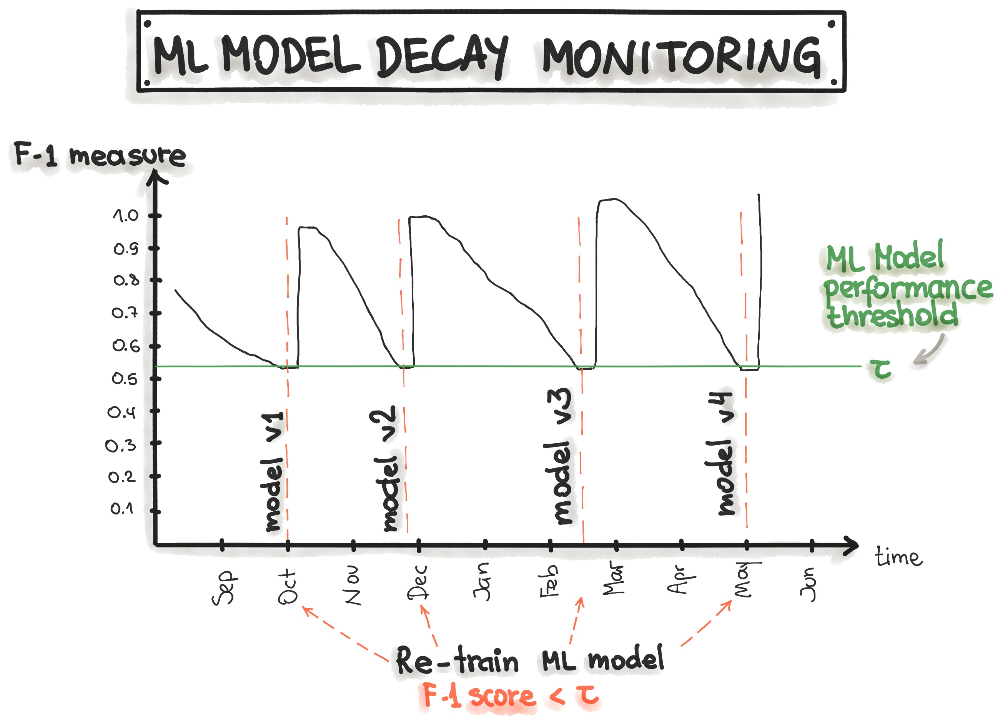
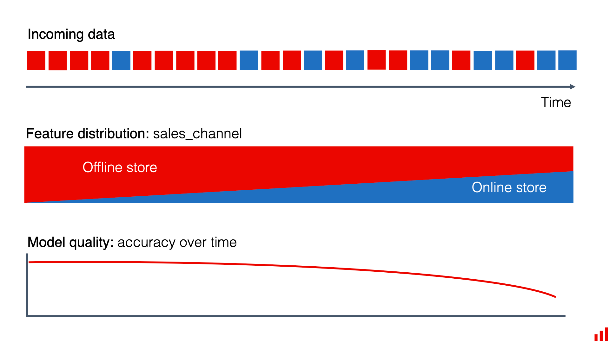
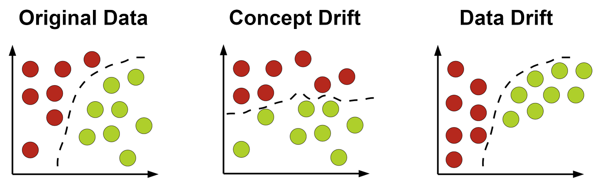
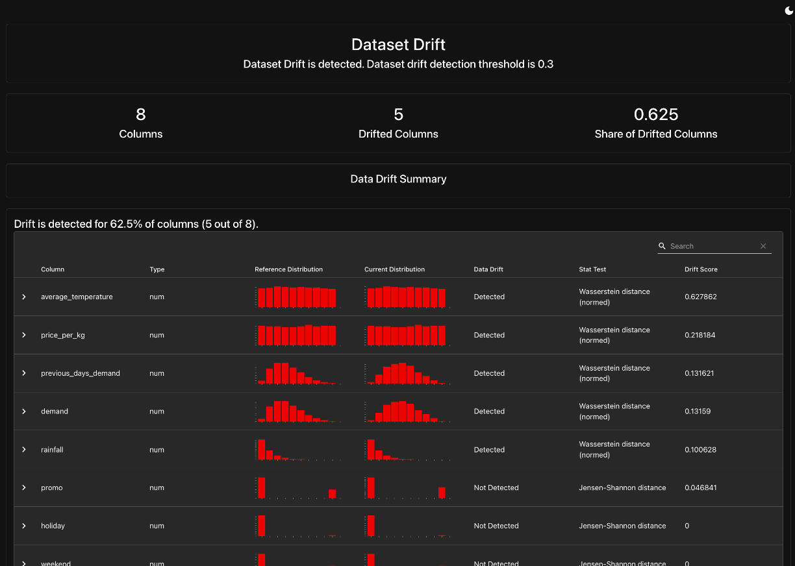
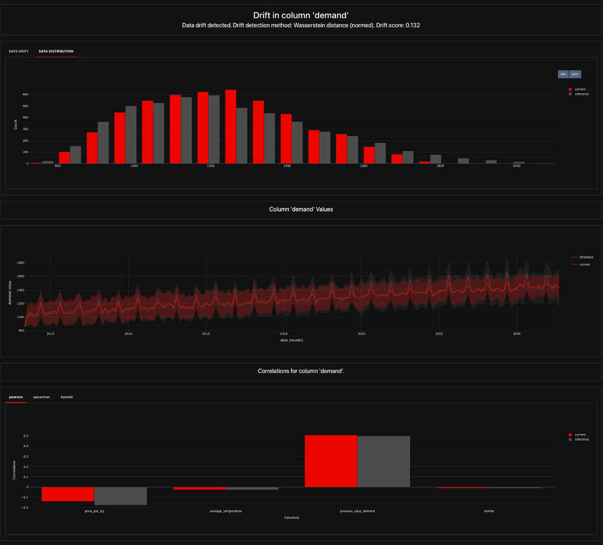
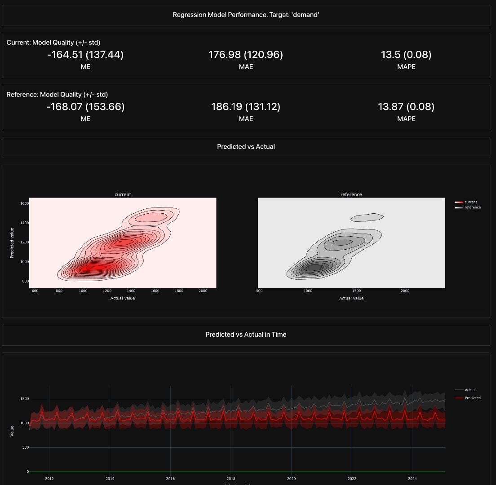

# Model Monitoring

::: {.callout-warning}
This chapter is currently in development.
:::

Deploying a machine learning model is not the final step in an ML workflow, it’s just the beginning. Once a model is in production, its performance can degrade over time due to changes in data patterns, evolving user behavior, or shifts in external factors that were not present in the training data. Without a robust monitoring system in place, organizations risk relying on outdated or inaccurate predictions, which can lead to poor business decisions and financial losses.

Model monitoring provides a structured way to continuously track and evaluate model performance, ensuring reliability and accountability in production environments. It helps detect issues such as data drift (when the input data distribution changes), concept drift (when the relationship between inputs and outputs evolves), and operational failures (such as increased response times or system crashes). By implementing real-time monitoring, data teams can identify problems early, trigger alerts, and take corrective action — whether by retraining the model, adjusting its parameters, or even rolling back to a previous version.

This chapter will explore the different **types of model monitoring**, the **key components of an effective monitoring system**, and **popular tools** used to track model performance. We’ll also walk through a hands-on example, where we implement a basic monitoring system for the apple demand forecasting model introduced in previous chapters. By the end, you’ll understand how to build scalable, automated monitoring pipelines that keep models performant and aligned with business objectives.

## Why is Model Monitoring Important?

Machine learning models do not exist in a static environment—once deployed, they are exposed to new and evolving data that may differ from what they were trained on. Without continuous monitoring, model performance can degrade, leading to inaccurate predictions and potentially costly business decisions. Model monitoring is a critical component of an operational ML system, ensuring that models remain reliable, fair, and performant in real-world applications.

### Key Reasons for Model Monitoring

::: {.callout-note collapse="true"}
## Ensuring Performance Consistency

Over time, models may experience a decline in accuracy or other evaluation metrics due to shifts in data distributions or changes in real-world conditions. Monitoring helps track performance trends and detect issues early.
:::

::: {.callout-note collapse="true"}
## Detecting Data Drift and Concept Drift

Models rely on patterns in historical data to make predictions. If these patterns shift (data drift) or the relationship between input features and predictions changes (concept drift), the model may no longer be valid. Monitoring helps catch these shifts before they cause significant problems.
:::

::: {.callout-note collapse="true"}
## Maintaining Business Value

A poorly monitored model can lead to incorrect recommendations, financial losses, or compliance risks, depending on the application. By continuously tracking performance, organizations can proactively intervene when necessary.
:::

::: {.callout-note collapse="true"}
## Ensuring Operational Stability

Beyond accuracy, models must also function efficiently in production environments. Monitoring helps track API response times, infrastructure performance, and overall system health.
:::

To address these challenges, model monitoring systems track various aspects of model performance, including predictive accuracy, data consistency, and operational efficiency.

### Types of Model Monitoring

Effective model monitoring involves tracking multiple dimensions of model performance, data integrity, and system stability. The key types of monitoring include:

::: {.callout-note collapse="true"}
## Performance Monitoring

Performance monitoring tracks a model’s predictive accuracy over time to ensure that it continues to produce reliable outputs. Common metrics include:

- **Regression models:** RMSE (Root Mean Squared Error), MAE (Mean Absolute Error), R²
- **Classification models:** Accuracy, Precision, Recall, F1-score, AUC-ROC
- **Forecasting models:** MAPE (Mean Absolute Percentage Error), MSE (Mean Squared Error)

When a model’s performance declines beyond an acceptable threshold, teams can investigate the cause and take corrective action, such as retraining the model with fresh data or adjusting its hyperparameters.

::: {#fig-model-decay}


Performance monitoring tracks a model’s predictive accuracy over time. The decrease of the performance metric can be used to trigger model retraining, which leads to model recovery. [source](https://ml-ops.org/content/mlops-principles#monitoring)
:::

**Example:**  A demand forecasting model for a grocery retailer consistently achieves an RMSE of 50 units per week. However, after a few months, the RMSE increases to 120 units, indicating that the model’s predictions are becoming less reliable. Monitoring helps flag this change and allows the team to retrain the model with updated data.
:::

::: {.callout-note collapse="true"}
## Data Drift Monitoring

Data drift occurs when the statistical properties of input features change over time. This can lead to unexpected model behavior and degraded performance. Monitoring data drift involves tracking feature distributions and identifying deviations from the training data.

**Key Indicators of Data Drift:**

- Changes in mean, variance, or distribution of input features.
- Increased outliers in newly ingested data.
- Shift in feature correlations compared to the training dataset.

**Example:**

Imagine a retail chain that uses machine learning to predict how many products of a particular type they need to stock in each of their stores. They trained their model using historical sales data from the past few years.

Until now, most of their sales have been in physical stores, and their model has become quite good at forecasting demand for in-store products. However, as the retailer ran a marketing campaign to promote their new mobile app, there's been a significant shift towards online sales, especially for some product categories.

The training data didn't have enough online sales information, so the model didn't perform as well for this segment. But it didn't matter much because online sales were a small part of their business. With the surge in online shopping, the quality of the model's forecasts has significantly dropped, affecting their ability to manage inventory effectively.

This shift in sales channels, from predominantly in-store to largely online, is an example of data drift.

::: {#fig-data-drift}


An example of data drift is a change in sales distribution by channel. [source](https://www.evidentlyai.com/ml-in-production/data-drift)
:::

::: {.callout-tip}
Read more about data drift here: https://www.evidentlyai.com/ml-in-production/data-drift
:::

:::

::: {.callout-note collapse="true"}
## Concept Drift Monitoring

Concept drift happens when the relationship between input features and predictions changes over time. Unlike data drift (which concerns changes in input data distribution), concept drift affects how a model interprets data. While data drift describes changes in the data distribution, concept drift relates to changes in the relationships between input and target variables. Basically, concept drift means that whatever your model is predicting – it is changing.

**Common Causes of Concept Drift:**

- Changes in user behavior (e.g., customer preferences shift).
- Market changes affecting feature importance.
- Seasonality or external factors introducing new trends.

**Example:**

A recommendation system for an e-commerce website suggests products based on past user behavior. However, as new shopping trends emerge (e.g., a sudden rise in eco-friendly products), user preferences change. Concept drift monitoring helps detect these shifts and prompts model adjustments.

Another instance could be the onset of COVID-19, which transformed how people shopped and disrupted logistical patterns. In these cases, all previously created models became almost obsolete.

::: {#fig-concept-drift}


Whereas data drift refers to the shifts in input feature distributions, concept drift refers to shifts in the relationships between model inputs and outputs. [source](https://www.evidentlyai.com/ml-in-production/data-drift)
:::

::: {.callout-tip}
Read more about concept drift here: https://www.evidentlyai.com/ml-in-production/data-drift
:::

:::

::: {.callout-note collapse="true"}
## Operational Monitoring

Operational monitoring focuses on ensuring the reliability and efficiency of model-serving infrastructure. It tracks key deployment metrics, including:

- **API Latency:** Response time of the model’s predictions.
- **Infrastructure Load:** Resource consumption (CPU, memory, GPU usage).
- **Error Logs:** Detecting system failures, API timeouts, or unusual error rates.

**Example:** A fraud detection model deployed as an API for real-time transactions experiences an increase in response times from 100ms to 2 seconds. This delay could impact the customer experience and lead to transaction failures. Operational monitoring alerts engineers to the issue so they can optimize the model-serving pipeline.
:::

Model monitoring is a crucial part of maintaining ML models in production, ensuring they remain accurate, robust, and scalable. Whether tracking predictive performance, detecting data drift, or maintaining operational stability, effective monitoring allows teams to intervene before performance issues impact business decisions. In the next section, we will explore the **key components** of a robust model monitoring system, providing insights into what should be tracked and why.


## Key Components of Model Monitoring

Ensuring the reliability and accuracy of machine learning models in production requires a robust monitoring system. A well-designed model monitoring framework consists of multiple key components that provide insights into performance, data integrity, and operational stability. In this section, we break down the essential components of model monitoring and how they align with the four primary types of monitoring: ***performance monitoring, data drift monitoring, concept drift monitoring, and operational monitoring***.

::: {.callout-note collapse="true"}
## Data Logging & Storage

One of the foundational elements of model monitoring is **comprehensive data logging**. Every input fed into the model and every output generated should be logged and stored to enable retrospective analysis, debugging, and compliance auditing.

**What Needs to Be Logged?**

- **Input Features** – The actual data used for making predictions.
- **Model Predictions** – The output generated by the model.
- **Ground Truth Labels** – The actual observed outcomes (when available).
- **Metadata** – Additional details such as timestamps, user IDs, or session information.
- **Infrastructure Logs** – CPU/memory usage, response times, request logs.

**Why It Matters?**

- Enables **troubleshooting** when unexpected behavior occurs.
- Supports **comparative analysis** between different model versions.
- Facilitates **model retraining** by capturing historical data distributions.
- Aids in **regulatory compliance** by ensuring transparency.

**Example:**

Imagine a fraud detection model deployed at a financial institution. Logging transaction details (e.g., amount, location, device used) alongside fraud predictions allows auditors to investigate flagged transactions and detect inconsistencies in the model’s decision-making.
:::

::: {.callout-note collapse="true"}
## Model Performance Metrics

Tracking model performance over time ensures that predictions remain accurate and aligned with business goals. A model that performed well during training may degrade in production due to changing data distributions, adversarial behavior, or unanticipated scenarios.

**Key Metrics to Track**

- **Classification Models:** Accuracy, Precision, Recall, F1-score, AUC-ROC.
- **Regression Models:** RMSE, MAE, R², MAPE.
- **Forecasting Models:** Mean Squared Error (MSE), Symmetric Mean Absolute Percentage Error (SMAPE).
- **Operational Metrics:** Prediction latency, inference throughput.

**Why It Matters?**

- Detects **gradual performance degradation** over time.
- Helps diagnose if the model is suffering from **overfitting** or **underfitting**.
- Allows teams to **compare different models** before making updates.
- Helps assess whether a model meets **business KPI objectives**.

**Example:**

A customer support chatbot tracks its accuracy by monitoring whether users rephrase or repeat their questions after receiving responses. A decline in accuracy over time could indicate **drift in language patterns**, requiring the chatbot’s model to be retrained with updated conversations.
:::


::: {.callout-note collapse="true"}
## Data Drift Detection

Data drift occurs when the distribution of **input features** changes over time, making the model less reliable. This often happens due to seasonal trends, user behavior shifts, or external factors like economic fluctuations.


**What to Monitor?**

- **Feature Statistics** – Mean, variance, correlation between features.
- **Categorical Changes** – Shift in frequency of categorical variables.
- **New Feature Values** – The emergence of previously unseen data points.

**Why It Matters?**

- Prevents models from making predictions based on **outdated assumptions**.
- Helps ensure models are **trained on data distributions similar to production data**.
- Flags changes in data pipelines that may introduce **unexpected biases**.

**Example:**

A credit risk model was trained with past banking data assuming most applicants were full-time employees. Over time, the number of gig economy workers applying for loans increases significantly, leading to **data drift**. If not detected, the model may underperform or systematically **reject new valid applicants**.
:::


::: {.callout-note collapse="true"}
## Concept Drift Detection

Concept drift refers to **changes in the relationship between inputs and outputs**. Even if the input data distribution remains stable, the way features correlate with predictions may shift, leading to unreliable models.

**Types of Concept Drift**

- **Sudden Drift:** A major shift in feature importance occurs abruptly.
- **Incremental Drift:** The relationship between input and output changes gradually.
- **Recurring Drift:** Seasonal effects cause relationships to fluctuate over time.

**Why It Matters?**

- Ensures models do not rely on **outdated assumptions**.
- Identifies scenarios where the **meaning of labels changes**.
- Helps teams decide **when to retrain models** based on changing trends.

**Example:**

A product recommendation model trained pre-pandemic suggested travel-related products based on user browsing patterns. However, during the pandemic, **consumer behavior changed drastically**, and prior patterns no longer correlated with purchase behavior. The model's relevance degraded due to **concept drift**.
:::

::: {.callout-note collapse="true"}
## Infrastructure and API Monitoring

Beyond model predictions, monitoring the **technical health** of deployed models is equally important. Even the most accurate models can fail to provide value if they suffer from **downtime, latency issues, or resource constraints**.

**Key Infrastructure Metrics**

- **API Latency** – Time taken for the model to return a prediction.
- **Request Volume** – Number of prediction requests per second.
- **System Load** – CPU and memory consumption during inference.
- **Failure Rate** – Frequency of errors or timeouts in serving predictions.

**Why It Matters?**

- Prevents **service disruptions** by identifying infrastructure bottlenecks.
- Ensures **scalability** of model inference under high loads.
- Flags **API outages** before they impact users.

**Example:**

An e-commerce company deploys a dynamic pricing model that adjusts product prices in real time. If the model’s API slows down significantly on Black Friday due to high traffic, it could lead to **delayed price updates and revenue loss**. Monitoring API latency ensures infrastructure auto-scaling is triggered to handle increased demand.
:::

::: {.callout-note collapse="true"}
## Automated Alerts & Retraining Triggers

Once an issue is detected—whether it’s a drop in accuracy, data drift, or increased latency—it’s crucial to have an automated mechanism to trigger **alerts and model updates**.

**Common Alerting Triggers**

- **Performance Threshold Breach:** When accuracy falls below a pre-defined limit.
- **Significant Data Drift:** A major shift in feature distributions.
- **Inference Latency Spikes:** If model response time exceeds expectations.

**Retraining Triggers**

- **Scheduled Retraining:** Periodic model updates (e.g., weekly, monthly).
- **Adaptive Retraining:** Triggered only when performance degradation is detected.
- **Event-Driven Retraining:** Initiated based on major business events (e.g., new product launches).

**Why It Matters?**

- Ensures models remain **adaptive** to new data patterns.
- Reduces **manual intervention** in model maintenance.
- Provides a structured way to **validate and replace models safely**.

**Example:**

A financial forecasting model detects a **sudden spike in stock market volatility**. A retraining trigger is activated, updating the model with the latest market data to prevent outdated predictions.
:::

A comprehensive model monitoring framework tracks data quality, model performance, drift, and operational stability to ensure models remain reliable in production. Without proper monitoring, businesses risk deploying models that degrade silently, leading to poor decisions and lost revenue.

::: {.callout-tip collapse="false"}
## Collaboration in Model Monitoring

While understanding model monitoring is crucial for ML practitioners, not all components need to be built from scratch. Many organizations already have observability tools and monitoring infrastructure in place for API health, system performance, and automated alerting. Data scientists and ML engineers often work collaboratively with DevOps, IT, and software engineering teams to integrate ML-specific monitoring into existing platforms.

The key takeaway? As a data scientist or ML engineer, you should understand what needs to be monitored and how to interpret issues, but implementation may involve leveraging existing tools and working closely with platform engineers.
:::

In the next section, we will explore the tools and frameworks available to implement these monitoring components efficiently.

## Tools for Model Monitoring

Selecting the right tools for monitoring machine learning models depends on the specific **monitoring needs, infrastructure, and scalability requirements** of your organization. There is a growing ecosystem of **open-source** and **cloud-based** tools designed to track model performance, detect drift, and ensure reliability in production environments. Additionally, traditional Application Performance Monitoring (APM) tools play a critical role in operational monitoring to ensure API uptime and infrastructure stability.

Below, we explore some of the key tools across different categories.

::: {.callout-caution collapse="false"}
## A Rapidly Evolving Landscape

Model monitoring is a rapidly growing area within MLOps, with new tools and frameworks constantly emerging. Keeping up with all available tools can be overwhelming, but that shouldn’t be the primary focus. Instead of trying to learn every tool, data scientists and ML engineers should focus on understanding the core principles of model monitoring—tracking model performance, detecting drift, ensuring operational stability, and automating alerts. Once these fundamentals are clear, selecting the right tool becomes much easier, as the choice will be driven by the specific needs of the model and deployment environment.
:::

### Open-Source Monitoring Tools

Open-source tools provide flexible, customizable solutions for monitoring models without vendor lock-in. They are particularly useful and popular for detecting drift, tracking model performance over time, and ensuring model explainability.

::: {.callout-note collapse="true"}
## Evidently AI

Evidently AI is an open-source tool designed for monitoring data and concept drift, as well as tracking model performance over time. It also provides a set of prebuilt reports that visualize key monitoring metrics.

- **Key Features**:
  - Prebuilt dashboards for **monitoring feature drift and prediction distributions**.
  - Statistical tests to flag **significant data changes** over time.
  - Integrates with Jupyter Notebooks, Airflow, and other pipelines.
- **When to Use**: If you need **lightweight, flexible** monitoring integrated into **existing ML workflows**.
- **Advantages**:
  - Supports both batch and real-time monitoring.
  - Easy-to-use dashboard for quick insights.
  - Works well with Jupyter notebooks for exploratory analysis.
- **Disadvantages**:
  - Requires manual setup and integration into ML pipelines.
  - May not scale well for large enterprise use cases without additional infrastructure.
- 🔗 [Evidently AI Documentation](https://docs.evidentlyai.com/)
:::

::: {.callout-note collapse="true"}
## WhyLabs

WhyLabs is a scalable ML monitoring solution that provides anomaly detection for models in production. It integrates with tools like Evidently AI for enhanced drift detection.

- **Key Features**:
  - AI-powered **drift detection** and **explainability insights**.
  - **Automated alerts** when model performance deteriorates.
  - Privacy-friendly **data logging without sending raw data**.
- **When to Use**: If you need a **scalable, cloud-native monitoring tool** that integrates well with **production systems**.
- **Advantages**:
  - Uses AI-driven anomaly detection to proactively flag potential issues.
  - Scales well for large datasets and high-throughput models.
  - Provides automated root cause analysis to explain model failures.
- **Disadvantages**:
  - The open-source version (WhyLogs) requires additional engineering effort for full automation.
  - The cloud-based version (WhyLabs) involves additional costs for enterprise-grade monitoring.
- 🔗 [WhyLabs Documentation](https://whylabs.ai/)
:::

::: {.callout-note collapse="true"}
## Fiddler AI

Fiddler AI is designed for explainability, bias detection, and monitoring ML models in production. It allows teams to understand model decisions, identify biases, and track drift over time.

- **Key Features**:
  - Advanced **feature attribution and interpretability** methods.
  - Bias detection to ensure **fairness in model predictions**.
  - Real-time monitoring and debugging capabilities.
- **When to Use**: If your organization requires **model transparency and bias detection** as part of compliance.
- **Advantages**:
  - Provides interpretable explanations for ML predictions.
  - Strong emphasis on ethical AI and bias detection.
  - Supports continuous monitoring and alerts for model degradation.
- **Disadvantages**:
  - Primarily targeted at organizations concerned with model interpretability and fairness rather than general performance monitoring.
  - More complex setup compared to simpler monitoring tools.
- 🔗 [Fiddler AI Documentation](https://www.fiddler.ai/)
:::

::: {.callout-note collapse="true"}
## Arize AI

Arize AI is an ML observability platform that offers real-time performance tracking, drift detection, and bias identification. It supports both structured and unstructured data, making it useful for diverse ML applications.

- **Key Features**:
  - **Drift detection** for input data and predictions.
  - Performance tracking across multiple versions of a model.
  - **Heatmaps and visualization tools** for debugging model failures.
- **When to Use**: If you need **real-time performance monitoring** and **AI observability** across multiple ML models.
- **Advantages**:
  - Provides a comprehensive monitoring dashboard with intuitive visualizations.
  - Supports real-time model monitoring for immediate issue detection.
  - Strong integration with popular ML frameworks like TensorFlow and PyTorch.
- **Disadvantages**:
  - Requires ingestion of model logs into Arize's system, adding an additional dependency.
  - May not be as customizable as self-hosted solutions like Evidently AI.
- 🔗 [Arize AI Documentation](https://arize.com/)
:::


### Cloud-Based Monitoring Solutions

For organizations using cloud-based ML platforms, built-in monitoring tools provide seamless integration with cloud storage, deployment pipelines, and model registries.

::: {.callout-note collapse="true"}
## AWS SageMaker Model Monitor

SageMaker Model Monitor allows users to track and detect drift, bias, and model degradation in AWS-based ML deployments. It integrates with SageMaker endpoints and automatically logs key metrics.

- **Key Features**:
  - Detects **data drift, bias, and performance degradation**.
  - Automated logging and alerts via **AWS CloudWatch**.
  - Native integration with **S3, Lambda, and SageMaker Pipelines**.
- **When to Use**: If your models are deployed in **AWS SageMaker** and require **fully managed monitoring**.
- **Advantages**:
  - Fully integrated into the AWS ecosystem, making deployment seamless for AWS users.
  - Provides automated alerts based on pre-configured thresholds.
  - Supports integration with CloudWatch for centralized logging.
- **Disadvantages**:
  - Limited flexibility if the model is not deployed on AWS.
  - Cost can increase significantly with high-frequency monitoring.
- 🔗 [AWS SageMaker Model Monitor](https://docs.aws.amazon.com/sagemaker/latest/dg/model-monitor.html)
:::

::: {.callout-note collapse="true"}
## Google Vertex AI Model Monitoring

Google’s Vertex AI Model Monitoring provides automated drift detection, performance tracking, and alerting for models deployed on Google Cloud.

- **Key Features**:
  - Monitors feature drift and prediction distributions.
  - Triggers alerts when data distributions shift.
  - Integrates with **BigQuery, Cloud Logging, and AI Notebooks**.
- **When to Use**: If your models are deployed in **Google Cloud Vertex AI**.
- **Advantages**:
  - Offers built-in drift detection with statistical monitoring tools.
  - Strong integration with BigQuery and Google’s data ecosystem.
  - Can be easily configured with AutoML and custom ML models.
- **Disadvantages**:
  - Less flexibility for non-GCP deployments.
  - Might not support as many model frameworks compared to other solutions.
- 🔗 [Google Vertex AI Model Monitoring](https://cloud.google.com/vertex-ai/docs/model-monitoring)
:::

::: {.callout-note collapse="true"}
## Azure ML Monitoring

Azure ML Monitoring is a cloud-native monitoring service that helps teams track model performance and data drift for models deployed within Azure Machine Learning.

- **Key Features**:
  - Tracks model **accuracy, feature drift, and prediction consistency**.
  - Connects with **Azure Event Grid for automated alerts**.
  - Visual dashboards in **Azure ML Studio**.
- **When to Use**: If you use **Azure ML** and need **native model monitoring**.
- **Advantages**:
  - Provides integration with Azure’s suite of tools, such as Power BI and Data Factory.
  - Supports real-time model performance tracking and alerting.
  - Can automate model retraining based on monitoring triggers.
- **Disadvantages**:
  - Best suited for teams already using Azure’s ML infrastructure.
  - Can become costly for large-scale monitoring needs.
- 🔗 [Azure ML Monitoring](https://learn.microsoft.com/en-us/azure/machine-learning/how-to-monitor-models)
:::

### Logging & APM Tools (For Operational Monitoring)

Operational monitoring focuses on infrastructure, API uptime, latency, and system performance. While these tools do not track ML-specific metrics, they are essential for ensuring the stability and reliability of ML services.

::: {.callout-note collapse="true"}
## Prometheus & Grafana

Prometheus is an open-source monitoring system that collects real-time metrics, while Grafana is used for visualization. Together, they provide powerful infrastructure monitoring capabilities.

- **Key Features**:
  - Prometheus collects **time-series metrics** from deployed services.
  - Grafana provides **visual dashboards and alerts**.
  - Can monitor **CPU, memory, and response times** of ML APIs.
- **When to Use**: If you need **customized, self-hosted monitoring** for ML deployments.
- **Advantages**:
  - Widely used for monitoring API uptime, latency, and resource usage.
  - Highly customizable and works with Kubernetes-based deployments.
  - Open-source with strong community support.
- **Disadvantages**:
  - Requires engineering expertise to set up and maintain.
  - Lacks built-in ML-specific monitoring capabilities.
- 🔗 [Prometheus](https://prometheus.io/) | [Grafana](https://grafana.com/)
:::

::: {.callout-note collapse="true"}
## Datadog & New Relic

Datadog and New Relic are cloud-based APM (Application Performance Monitoring) solutions that track API performance, latency, and system health.

- **Key Features**:
  - **Automated anomaly detection** for infrastructure metrics.
  - **Distributed tracing** to track API response times.
  - Integrates with **AWS, GCP, and Kubernetes**.
- **When to Use**: If you need **enterprise-grade monitoring** for cloud-based ML applications.
- **Advantages**:
  - Easy to set up and integrate with cloud services.
  - Provides real-time dashboards and automated alerts.
  - Supports distributed tracing to diagnose model serving issues.
- **Disadvantages**:
  - More focused on infrastructure monitoring than ML-specific issues like drift detection.
  - Can be expensive for high-volume logging and monitoring.
- 🔗 [Datadog](https://www.datadoghq.com/) | [New Relic](https://newrelic.com/)
:::

Selecting the right monitoring tool depends on your model deployment environment, monitoring needs, and infrastructure. In many organizations, a combination of ML monitoring tools (e.g., Evidently AI, SageMaker Model Monitor) and APM tools (e.g., Prometheus, Datadog) is used to provide comprehensive observability.

| **Tool Category** | **Best For** | **Example Tools** |
|-------------------|-------------|-------------------|
| **Open-Source Model Monitoring** | Customizable, lightweight ML monitoring | Evidently AI, WhyLabs, Fiddler AI, Arize AI |
| **Cloud-Native Model Monitoring** | Fully managed monitoring for cloud ML platforms | AWS SageMaker Model Monitor, Google Vertex AI Model Monitoring, Azure ML Monitoring |
| **Operational Monitoring** | Infrastructure, API latency, and uptime tracking | Prometheus, Grafana, Datadog, New Relic |

In the next section, we will implement a hands-on example to help demonstrate how to set up model monitoring in practice.


## Hands-On Example: Implementing Model Monitoring

In the previous chapter, we deployed a machine learning model as an API using FastAPI. However, deploying a model is only part of the journey, ensuring it continues to perform well over time is equally critical. In this hands-on example, we will extend our deployed model by incorporating monitoring capabilities, allowing us to track performance, detect drift, and ensure operational stability.

This exercise will introduce you to practical model monitoring techniques, demonstrating how to:

- **Log incoming data and predictions** to track model performance in production.
- **Detect data drift** using [Evidently](https://www.evidentlyai.com/), which helps determine if incoming data distributions are changing over time.
- **Monitor API performance** (latency, request counts, and errors) using [Prometheus](https://prometheus.io/) and visualize it in [Grafana](https://grafana.com/).
- **Automate monitoring and alerts** to proactively identify issues before they impact business decisions.

### Why is This Important?

In real-world applications, an ML model that performs well during training may degrade over time due to shifting data patterns (data drift), changes in the relationship between inputs and outputs (concept drift), or due to changes in API performance (i.e. latency). Without proper monitoring, these changes can go unnoticed, leading to poor predictions, financial losses, or operational disruptions.

For instance, in our apple demand forecasting model, what if consumer behavior changes due to a sudden price increase, or a competitor introduces a promotional campaign, or maybe a hot new apple martini recipe is trending on social media and all of a sudden demand has exceeded any amounts we've seen previously? If our model does not adapt to these changes, inventory predictions may become inaccurate, leading to overstocking or shortages. Monitoring allows us to detect such changes early and trigger necessary actions, such as model retraining or adjusting forecasting strategies.

This section will demonstrate how to incorporate fundamental monitoring so that by the end of this chapter, you will have a well-monitored ML model that logs incoming data, detects drift, tracks API performance, and provides real-time insights through dashboards and alerts. This will help ensure your deployed model remains reliable and accurate over time.

### Prerequisites

Before proceeding, make sure you have the following:

- We'll be building onto the previous hands-on examples where the apple demand forecasting model was trained, logged and versioned to MLflow and then predictions were served with a FastAPI. If you want to recreate this section then be sure have successfully reproduced [Section @sec-model-experimentation-exercise], [Section @sec-model-version-example], and [Section @sec-model-deploy-example].
- You'll also need the following packages installed.^[See the [modelops-monitoring-requirements.txt](https://github.com/bradleyboehmke/uc-bana-7075/blob/main/ModelOps/modelops-monitoring-requirements.txt) file.]

```bash

```

With these prerequisites met, let’s move on to setting up the monitoring infrastructure!

### Setting Up the Monitoring Infrastructure

The first step is to implement a logging mechanism to capture all incoming prediction requests and their corresponding outputs. This will allow us to:

- Track model behavior over time.
- Detect potential data drift and concept drift.
- Identify issues in the model's performance before they impact business decisions.

This is the first step toward building a fully automated monitoring system.

::: {.callout-tip}
In a real-world enterprise system, logged data would typically be stored in a centralized logging database (i.e. PostgreSQL, MySQL, NoSQL) or a cloud-based storage system (i.e. BigQuery, AWS S3). However, for this hands-on example, we will log predictions locally to a CSV file.
:::

To implement logging, we will modify our FastAPI application to:

1. Log incoming requests (input features) and corresponding predictions.
2. Store logs in a CSV file (prediction_logs.csv).
3. Include timestamps and status messages for error tracking.

The primary code that we will add includes:

```python
# Define log file path
LOG_FILE_PATH = "prediction_logs.csv"

# Ensure log file exists with headers
if not os.path.exists(LOG_FILE_PATH):
    pd.DataFrame(columns=[
        "timestamp", "request_type", "input_data", "predictions", "status"
    ]).to_csv(LOG_FILE_PATH, index=False)

# Primary function to log inputs & predictions
def log_request(request_type, input_data, predictions, status):
    """Logs the request details to a CSV file."""
    log_entry = pd.DataFrame([{
        "timestamp": datetime.datetime.now().isoformat(),
        "request_type": request_type,
        "input_data": json.dumps(input_data),
        "predictions": json.dumps(predictions),
        "status": status
    }])
    log_entry.to_csv(LOG_FILE_PATH, mode='a', header=False, index=False)
```

We can then add a call to the `log_request()` function inside the function definitions for `predict_single()` and `predict_batch()`.  You can see the full revised FastAPI code below or also [here](https://github.com/bradleyboehmke/uc-bana-7075/blob/main/ModelOps/fastapi_with_monitoring_app.py).

::: {.callout-note collapse="true"}
## Revised FastAPI code

```python

```
:::

Once the FastAPI code is modified, we can can test it by running the FastAPI app (either directly or by running with Streamlit as discussed in [Section @sec-fastapi-streamlit-together]).  Go ahead and make some predictions and you'll notice a `prediction_logs.csv` is created in your directory that will resemble the following, which includes the timestamp of the prediction, the type of request (single vs. batch), the input data fed into the model, the prediction the model made, and even the error message if an issue occurred.

**Example of Logged Data:**

| Timestamp       | Request Type | Input Data | Predictions | Status  |
|-------------|---------|--------------|-------------|---------|
| 2025-02-01T14:12:00Z   | Single      | {"temp": 30, "rainfall": 2.1, ..., "promo": 1} | 1250.4 | Success |
| 2025-02-01T14:15:12Z   | Batch       | [{"temp": 28, "rainfall": 1.8, ...}, {"temp": 27, "rainfall": 2.5, ...}] | [1185.2, 1200.8] | Success |
| 2025-02-01T14:20:30Z   | Single      | {"temp": 35, "rainfall": 3.0, "promo": 0} | None | Error: Missing feature |

Now that we are storing historical inputs and predictions, we can move forward to drift detection — analyzing whether our model is still making accurate predictions or if data patterns have changed significantly.

### Monitoring Model Performance with Evidently AI

As machine learning models operate in real-world environments, they face evolving data distributions, shifting relationships between features and target variables, and potential degradation in predictive performance. [Evidently AI](https://www.evidentlyai.com/) is an open-source tool designed to help teams monitor, diagnose, and address these changes through drift detection and performance monitoring.

#### Examples of Implementing Evidently

This section provides an overview of how to use Evidently AI to track **feature drift**, **concept drift**, and **model performance drift**, ensuring our apple demand forecasting model remains accurate and reliable.^[You can also refer to this notebook: [https://github.com/bradleyboehmke/uc-bana-7075/blob/main/ModelOps/model-drift-monitoring.ipynb](https://github.com/bradleyboehmke/uc-bana-7075/blob/main/ModelOps/model-drift-monitoring.ipynb)]  Below, we demonstrate how to generate Evidently AI reports to assess different types of drift using artificially generated datasets.

::: {.callout-note collapse="true"}
## Detecting Feature Drift

**Feature drift** occurs when the distribution of input features changes significantly from the training data, potentially making the model's learned patterns obsolete. This could be due to seasonal trends, economic shifts, or data collection changes.

The code below provides an example of using Evidently for feature drift analysis.  Using the [`apple_data.py`](https://github.com/bradleyboehmke/uc-bana-7075/blob/main/ModelOps/apple_data.py) module, we generate:

- A **baseline dataset** representing normal, expected conditions. This would typically be the original dataset your current model in production was trained on.
- A **drifted dataset**, where key features such as temperature, rainfall, and pricing have shifted.



We can then use Evidently AI's **DataDriftPreset** to analyze the distribution changes across features and then save the results to a `data_drift_report.html` file:



This will create a Feature Drift Report (`data_drift_report.html`) that provides a side-by-side comparison of the feature distributions in the **baseline dataset** (reference data) and the **drifted dataset** (current data).

::: {#fig-feature-drift-report}


Snapshot of the feature drift report.
:::

The key components of this report include:

- **Feature Distribution Comparisons**: Visual histograms and statistical tests (e.g., Kolmogorov-Smirnov, Jensen-Shannon) to highlight significant shifts in individual feature distributions.
- **Drift Detection Summary**: A table listing all monitored features, their calculated drift scores, and whether the drift is deemed significant.
- **Overall Data Drift Score**: A single metric summarizing how much the dataset has changed, indicating whether the current dataset is still representative of the training data.

::: {.callout-tip}
By default, Evidently will use 50% of the feature columns as the cutoff to determine if there is enough overall drift to want concern; however, you can set that as we did in the code with `drift_share=0.3`.  This is a cutoff that you and your team needs to determine what amount of drift warrants concern.  If this threshold is breached, it suggests that the model may be making predictions on a data distribution it was not trained on, increasing the risk of inaccurate forecasts.
:::

:::


::: {.callout-note collapse="true"}
## Detecting Concept Drift (Target Variable Drift)

**Concept drift** occurs when the relationship between input features and the target variable (e.g., demand) changes. Even if the feature distributions remain stable, the way they impact predictions may shift.

To detect whether the target variable has changed, we can use Evidently AI’s `TargetDriftPreset()` to analyze drift in the target variable (`y`). This will evaluate both **changes in its distribution** and **shifts in its relationship with feature variables**.

First, it compares the statistical distribution of the target variable in the baseline dataset (training data) to the current dataset (recent predictions), using statistical tests such as the Kolmogorov-Smirnov test or Jensen-Shannon divergence. If the target’s distribution has significantly changed, this indicates **target drift**, meaning the model’s assumptions about the outcome variable may no longer hold.

Additionally, `TargetDriftPreset()` assesses the correlation between the target and input features — if the strength or direction of relationships between features and the target shifts significantly, this suggests **concept drift**. For instance, if `price_per_kg` was previously a strong predictor of demand but has become less relevant in the new data, it may indicate a fundamental change in consumer behavior, requiring model retraining or adaptation.

The following code implements `TargetDriftPreset()` and then saves the results to a `concept_drift_report.html` file:



This will create a Feature Drift Report (`concept_drift_report.html`) that includes:

- **Target Variable Distribution Analysis**: Visual and statistical comparisons of how the target variable (apple demand) behaves in the baseline dataset vs. the drifted dataset.
- **Correlation Shift Analysis**: If configured, the report can highlight whether the relationship between features and the target variable has changed.
- **Concept Drift Detection**: A statistical test that determines whether the demand predictions based on old patterns are still valid in the current dataset.

::: {#fig-concept-drift-report}


Snapshot of the concept drift report.
:::

:::


::: {.callout-note collapse="true"}
## Detecting Model Performance Drift

Even if input features and target values remain stable, a model can degrade due to changes in underlying data relationships, outdated assumptions, or external factors. Tracking model performance over time helps detect these issues.

Evidently AI provides the `RegressionPreset()` and `ClassificationPreset()` metrics to track and evaluate model performance drift over time. These presets help monitor whether a model's predictions remain accurate and reliable as new data flows in.

- The `RegressionPreset()` is designed for continuous target variables (e.g., sales forecasts) and evaluates metrics like RMSE, MAE, R², and residual analysis to detect shifts in prediction errors. If RMSE increases significantly compared to the reference dataset, it may indicate that the model is underperforming due to data drift or concept drift.
- Similarly, `ClassificationPreset()` is tailored for classification tasks and tracks key metrics such as accuracy, precision, recall, F1-score, and ROC-AUC. It flags performance degradation if there’s a drop in classification confidence or an increase in misclassification rates.

The following code implements `RegressionPreset()` and then saves the results to a `performance_report.html` file:



The Model Performance Drift Report provides:

- **Performance Metrics Comparison**: Side-by-side evaluation of model accuracy, highlighting whether predictive performance has worsened on new data.
- **Residual Analysis**: Visual plots showing whether model errors have increased significantly in specific regions of the data.
- **Feature Importance Changes** *(if enabled)*: A comparison of how feature importance scores have shifted, indicating whether the model is relying on different patterns than before.

::: {#fig-performance-drift-report}


Snapshot of the model performance drift report.
:::

::: {.callout-tip}
By using these presets, teams can proactively identify when a model's predictions start deviating, allowing them to trigger alerts, diagnose potential drift, and determine whether retraining is necessary to maintain high model accuracy in production.
:::

:::


Evidently AI offers a robust framework for detecting and visualizing drift in machine learning models. While the examples provided here demonstrate the basics of monitoring **feature drift, target drift, and model performance drift**, Evidently includes many additional capabilities, such as bias detection, data integrity checks, and customizable dashboards for ongoing model monitoring. These advanced features can provide deeper insights into why a model's performance is changing over time. In the next section, we will take these concepts further by **integrating Evidently AI into our production pipeline**, demonstrating how to automate drift detection and implement real-time model monitoring. Along the way, we will also introduce additional functionalities that Evidently provides, reinforcing its role in maintaining reliable and high-performing ML systems in production.

#### Implementing Evidently into Our Pipeline

::: {.callout-warning}
This section is currently in development. Check back soon for updates.  For students in the current course offering, you will be expected to discuss how monitoring could be implemented into your system but you will not be required to fully integrate model monitoring into your system.
:::

#### Visualizing Model Monitoring in Streamlit

::: {.callout-warning}
This section is currently in development. Check back soon for updates.  For students in the current course offering, you will be expected to discuss how monitoring could be implemented into your system but you will not be required to fully integrate model monitoring into your system.
:::

#### Automating the Monitoring Pipeline

::: {.callout-warning}
This section is currently in development. Check back soon for updates.  For students in the current course offering, you will be expected to discuss how monitoring could be implemented into your system but you will not be required to fully integrate model monitoring into your system.
:::


### Setting Up Operational Monitoring with Prometheus and Grafana

::: {.callout-warning}
The following sections are currently in development. Check back soon for updates.  For students in the current course offering, you will be expected to discuss how monitoring could be implemented into your system but you will not be required to fully integrate these concepts into your system.
:::

#### **A. Introduction to Prometheus and Grafana**
- **Why These Tools?**
  - Prometheus: Captures API request latency, response times, and error rates.
  - Grafana: Visualizes the collected data with dashboards.

#### **B. Configuring Prometheus to Track API Performance**
- **Implementation**:
  - Expose FastAPI metrics using **Prometheus FastAPI Instrumentator**.
  - Configure Prometheus to scrape metrics from the API.
  - Track response time, request count, and error rates.

#### **C. Setting Up a Grafana Dashboard**
- **Implementation**:
  - Connect Prometheus as a data source in Grafana.
  - Build a dashboard to visualize API performance.
  - Configure alerts for high latency or errors.


### Automating Monitoring & Alerts

::: {.callout-warning}
The following sections are currently in development. Check back soon for updates.  For students in the current course offering, you will be expected to discuss how monitoring could be implemented into your system but you will not be required to fully integrate these concepts into your system.
:::

#### **A. Scheduling Drift Checks**
- **Implementation**:
  - Use a cron job or scheduler to run drift checks periodically.
  - Store results and generate alerts if drift is detected.

#### **B. Setting Up Alerting with Prometheus & Grafana**
- **Implementation**:
  - Define alert rules in Prometheus for API performance issues.
  - Send notifications via email, Slack, or webhooks when issues arise.


### Challenges & Considerations

While tools such as Evidently, Prometheus, and Grafana simplify the process of model monitoring, several challenges commonly arise during implementation. Awareness of these can significantly enhance your monitoring strategy's effectiveness. Some of these common challenges include:

::: {.callout-note collapse="true"}
## Data Drift Detection Sensitivity

- **Challenge**: Tools like Evidently may produce false positives or overlook subtle drift.
- **Approach**: Carefully calibrate drift thresholds based on historical data trends and perform periodic threshold tuning.
:::

::: {.callout-note collapse="true"}
## Operational Overhead

- **Challenge**: Setting up comprehensive operational monitoring with Prometheus and Grafana can become complex and resource-intensive.
- **Approach**: Start with monitoring critical metrics only, progressively expanding your monitoring setup as resources and expertise grow.
:::

::: {.callout-note collapse="true"}
## Alert Fatigue

- **Challenge**: Automated alerts can quickly overwhelm teams, leading to missed critical notifications.
- **Approach**: Prioritize alert criteria and establish tiered alerting systems, escalating only critical issues immediately while batching lower-priority notifications.
:::

::: {.callout-note collapse="true"}
## Integration Complexity

- **Challenge**: Integrating multiple tools (Evidently, Prometheus, Grafana) can introduce integration complexities and compatibility issues.
- **Approach**: Adopt modular design patterns and leverage standard APIs, ensuring each tool integrates smoothly with existing infrastructure.
:::

Implementing effective monitoring requires careful attention beyond selecting tools—here are essential considerations to ensure successful outcomes:

- **Continuous Improvement:** Regularly review and refine monitoring thresholds and alert mechanisms based on evolving business requirements and operational feedback.
- **Clear Accountability:** Clearly define roles and responsibilities for monitoring tasks, responses, and decision-making processes, ensuring accountability and effective management of monitoring systems.
- **Cross-Functional Collaboration:** Foster collaboration by creating accessible, intuitive dashboards that engage various stakeholders—data scientists, engineers, product teams, and business leaders.
- **Documentation and Communication:** Maintain detailed documentation of monitoring processes, alert procedures, and troubleshooting steps to streamline response efforts and knowledge sharing across the team.
- **Training and Knowledge Transfer:** Provide ongoing training to teams on monitoring tools and methodologies, facilitating continuous skill enhancement and effective utilization of monitoring insights.

By proactively recognizing these challenges and applying thoughtful approaches, organizations can maximize the value of their monitoring systems and ensure ongoing reliability of machine learning models.


## Summary

Effective model monitoring is a critical component of ModelOps, ensuring continued performance and reliability of deployed models. This chapter discussed key considerations, practical tools, and implementation strategies necessary for robust monitoring.

We explored how tools such as Evidently, Streamlit, Prometheus, and Grafana play crucial roles in detecting model degradation, data drift, and performance anomalies. Additionally, the chapter highlighted the importance of visualizing monitoring insights for broad stakeholder engagement and operational transparency.

Challenges such as drift sensitivity, operational complexity, alert fatigue, and integration intricacies were addressed, with actionable strategies provided to mitigate these issues. Emphasizing modular integration, automated processes, and continuous improvement were recommended best practices.

Ultimately, adopting a systematic approach to monitoring, combined with a clear understanding of potential pitfalls, empowers organizations to maintain high-performing, trustworthy machine learning systems.


## Exercise

::: {.callout-warning}
This section is currently in development. Check back soon for updates.
:::

- **Conceptual Design:**
  - Identify key performance metrics and drift detection methods for monitoring a real-world ML system.
- **Hands-On Task:**
  - Using **Evidently AI**, monitor a sample dataset for data drift.
  - Simulate incoming requests and track performance over time.
  - Set up an alerting mechanism for degraded model performance.
- **Reflection on Monitoring Challenges:**
  - What challenges might arise in deploying a real-world monitoring system?
  - How do design principles from Chapter 1 apply to model monitoring?


## LLM Exercise

In previous chapters, we discussed an AI-powered customer support assistant for a robotics company. We created an LLM-based assistant that can answer user queries using product manuals and FAQs. Now, let's design a comprehensive monitoring strategy for this customer support assistant.

Unlike traditional models with clear metrics like RMSE or accuracy, monitoring LLMs requires a more nuanced approach that combines quantitative metrics with qualitative assessment. The generative property of LLMs present unique challenges, they generate natural language responses that can be contextually correct but factually wrong, they may hallucinate information, and their performance can degrade in subtle ways that aren't immediately apparent.


### Logging

Logging is the foundation that enables us to track a variety of metrics and build a comprehensive monitoring strategy. For an LLM-powered customer support assistant, we need to capture structured data that supports both real-time monitoring and retrospective analysis. The key is to log the essential elements that enable metric calculation while balancing storage costs and privacy requirements.

#### Essential Log Structure

For each interaction, we should capture:

**Core Data**: Query text (raw and processed), model responses, conversation metadata (ID, user, timestamp), and response generation details (token count, generation time, model settings).

**Quality Indicators**: Confidence scores, retrieval relevance, safety flags, and any automated quality checks. These could be automated, or human labels for a sample of data.

**User Interaction Context**: Session flow, user feedback, escalation status, and task completion indicators.

**Business Context**: Product information, user profile, knowledge base version, and access channel.

**Example comprehensive log entry:**
```json
{
  "conversation_id": "conv_12345",
  "user_id": "user_67890",
  "timestamp": "2025-01-15T14:30:25Z",
  "query_raw": "My robot won't turn on. What should I do?",
  "query_processed": "robot power issue troubleshooting",
  "response_full": "I understand your robot isn't turning on. Let's troubleshoot this step by step: 1 - Check if the charging cable is securely connected...",
  "response_token_count": 156,
  "generation_time_ms": 1240,
  "model_temperature": 0.7,
  "rag_context_used": ["troubleshooting_guide_v2.3", "power_issues_faq"],
  "confidence_score": 0.89,
  "safety_check": "passed",
  "user_satisfaction_rating": 4,
  "task_completed": true,
  "product_model": "HomeBot_Pro_v2.1",
  "knowledge_base_version": "kb_v3.2",
  "access_channel": "mobile_app"
}
```

This structured logging approach provides the raw data needed to calculate the detailed metrics discussed in the following section, while maintaining efficiency and privacy compliance.


### Metrics to Monitor

While logging captures raw data, metrics transform this data into actionable insights that align with business objectives. For example, while we log individual user satisfaction ratings, we derive metrics like "weekly average satisfaction score" or "percentage of conversations with ratings below 3" to track performance trends and identify areas needing improvement.

Consider the following areas for monitoring LLM performance:

#### System Performance

- Operational Metrics: Monitor response latency, token generation speed, memory usage, and API availability to ensure the system maintains acceptable performance under load.

#### Data Drift Detection

Traditional drift detection methods (mean, variance, outliers) don't work directly on text data. However we could extract second level metrics to understand drift. Drift could be of many types. Techniques like text embeddings can be used to track changes in the semantic distribution of user queries over time.

- Vocabulary Drift: Monitor the emergence of new technical terms, product names, or user language patterns.
- Query Complexity Drift: Track changes in query length, complexity, and linguistic patterns that might indicate users are asking increasingly sophisticated questions.
- Topic Distribution Drift: Use topic modeling to identify shifts in the types of issues users are asking about, which could indicate new product problems or usage patterns.

::: {.callout-note}
It's important to distinguish between genuine data drift and inherent biases in training data or model limitations. Apparent "data drift" may actually represent legitimate user diversity or edge cases that weren't adequately represented in the original training dataset, rather than a true shift in the underlying data distribution.
:::

#### Concept Drift

Concept drift occurs when the relationship between user queries and expected responses changes. For our robot support assistant, this might manifest as:

- Product Evolution: When the robot receives software updates or new features, previously correct responses may become outdated. For example, if a firmware update changes how the robot handles a particular task, existing FAQ responses become incorrect.
- User Behavior Changes: As users become more familiar with the robot, their questions might become more technical or assume greater product knowledge, requiring more sophisticated responses.
- Seasonal or Contextual Shifts: Holiday seasons, new product launches, or external events (like supply chain issues) might change the types of support queries and required responses.

**Example scenarios that would indicate concept drift:**

- Users asking "Why won't my robot charge?" might initially be answered with basic troubleshooting steps, but after a product recall, the correct response should direct users to contact support immediately.
- A question about "robot navigation issues" might require different answers depending on whether the user has the original software version or the updated navigation system.

#### Response Quality

To determine if model responses remain usable, consider metrics like factual accuracy, relevance and completeness.

- Factual Accuracy: Fact-checking against the knowledge base to ensure responses don't contradict official documentation, and they are correct. Track semantic similarity between generated responses and expected answers using techniques like embedding similarity scores, BLEU scores for factual accuracy.
- Response Relevance: Responses are topically relevant to user queries.
- Response Completeness: Whether responses address all aspects of multi-part questions.
- User Engagement Metrics: Track conversation completion rates, conversation abandonements, user conversations lengths, user satisfaction scores, and whether users need to rephrase questions or escalate to human support.

::: {.callout-note}
How can we quantify these metrics in practice? What specific data should we extract from system logs, and how do we construct meaningful metrics? For instance, how do we measure conversation abandonment rates, detect when users need to rephrase questions, or identify inappropriate/toxic responses?
:::

Can we fully automate the measurement of these quality metrics, or is human evaluation of response samples necessary? If human review is required, what sampling strategy should we implement to ensure comprehensive coverage while maintaining efficiency?


#### Hallucination and Safety Monitoring

Critical metrics for ensuring our customer support assistant remains reliable:

- Hallucination Detection: Implement systems to detect when the model generates information not present in the knowledge base, such as making up product specifications or troubleshooting steps.
- Safety Compliance: Monitor for responses that might suggest unsafe robot operations or violate safety guidelines.
- Content Safety Metrics: Monitor for inappropriate responses, toxic language, or responses that might violate company policies or safety guidelines.

::: {.callout-note}
Remember that you fine-tuned an already pre-trained LLM model. Even though the robotics company may have carefully curated their FAQs and product manuals to remove bias, the underlying LLM still carries potential biases from its original training data. These inherited biases could cause the AI-powered customer support assistant to generate unexpected or problematic responses that don't align with the company's values or customer service standards.

This makes bias detection and fairness monitoring particularly important for customer-facing LLM applications, as these inherited biases may not be immediately apparent during initial testing with curated company data.
:::

### Retraining Triggers

#### Monitoring-Based Retraining Strategy

Based on the monitoring framework above, several events should trigger model refresh or fine-tuning:

- Performance Degradation: If user satisfaction scores drop below a threshold or escalation rates increase significantly.
- Knowledge Base Updates: When product manuals, FAQs, or troubleshooting guides are updated, the model should be retrained to incorporate new information.
- Semantic Drift Detection: If embedding-based analysis shows user queries have shifted significantly from training data distribution, indicating the model may not understand new query patterns.
- Factual Accuracy Decline: If accuracy/quality metrics reveal increasing inconsistencies between model responses and official documentation.

#### Adaptive vs. Scheduled Retraining

Scheduled Retraining (example: monthly):
- Advantages: Predictable resource allocation, regular incorporation of new data, easier to plan and budget for computational resources.
- Disadvantages: May miss critical issues that emerge between scheduled updates, potentially wastes resources retraining when performance is stable.

Adaptive Retraining (trigger based):
- Advantages: More responsive to actual performance issues, efficient use of resources, can address critical problems immediately.
- Disadvantages: Requires more sophisticated monitoring infrastructure, may be reactive rather than proactive, resource planning is more complex.

**Recommended Hybrid Approach**: Implement adaptive triggers for critical issues (safety, major factual errors) while maintaining a regular monthly schedule for general knowledge updates and performance optimization.

### Balancing Business Continuity with Model Improvement

Remember that our initial problem was the robotics company's inability to scale customer support with increasing user queries. Any monitoring and retraining strategy must keep in mind that original goal.

- Maintaining Service Quality: Ensuring the assistant continues to resolve user issues effectively while minimizing false or harmful responses.
- Operational Efficiency: Keeping the system running smoothly without frequent disruptions or degraded performance.
- Resource Management: Balancing computational costs of monitoring and retraining with the business value of improved support quality.
- User Experience: Ensuring that model updates enhance rather than disrupt the user experience, maintaining consistency in interaction patterns users have learned to expect.

The ultimate goal is to create a monitoring system that keeps the customer support assistant effective and reliable, reducing the burden on human support staff while maintaining high user satisfaction and safety standards.
